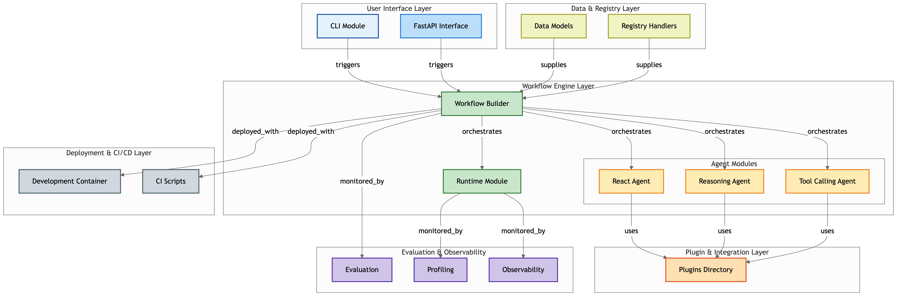

<!--
SPDX-FileCopyrightText: Copyright (c) 2024-2025, NVIDIA CORPORATION & AFFILIATES. All rights reserved.
SPDX-License-Identifier: Apache-2.0

Licensed under the Apache License, Version 2.0 (the "License");
you may not use this file except in compliance with the License.
You may obtain a copy of the License at

http://www.apache.org/licenses/LICENSE-2.0

Unless required by applicable law or agreed to in writing, software
distributed under the License is distributed on an "AS IS" BASIS,
WITHOUT WARRANTIES OR CONDITIONS OF ANY KIND, either express or implied.
See the License for the specific language governing permissions and
limitations under the License.
-->


# NVIDIA NeMo Agent Toolkit

<!-- vale off (due to hyperlinks) -->
[](https://opensource.org/licenses/Apache-2.0)
[](https://github.com/NVIDIA/NeMo-Agent-Toolkit/releases)
[](https://pypi.org/project/nvidia-nat/)
[](https://pepy.tech/projects/nvidia-nat)
[](https://github.com/NVIDIA/NeMo-Agent-Toolkit/issues)
[](https://github.com/NVIDIA/NeMo-Agent-Toolkit/pulls)
[](https://github.com/NVIDIA/NeMo-Agent-Toolkit)
[](https://github.com/NVIDIA/NeMo-Agent-Toolkit/network/members)
<!-- vale on -->

NVIDIA NeMo Agent toolkit is a flexible, lightweight, and unifying library that allows you to easily connect existing enterprise agents to data sources and tools across any framework.

> [!NOTE]
> NeMo Agent toolkit was previously known as the Agent Intelligence (AIQ) toolkit, and <!-- vale off -->AgentIQ<!-- vale on -->. The library was renamed to better reflect the purpose of the toolkit and to align with the NVIDIA NeMo family of products. The core technologies, performance and roadmap remain unchanged and the API is fully compatible with previous release. Please refer to the [Migration Guide](./docs/source/resources/migration-guide.md) for more information.

## ✨ Key Features

- 🧩 [**Framework Agnostic:**](./docs/source/quick-start/installing.md#framework-integrations) NeMo Agent toolkit works side-by-side and around existing agentic frameworks, such as [LangChain](https://www.langchain.com/), [LlamaIndex](https://www.llamaindex.ai/), [CrewAI](https://www.crewai.com/), and [Microsoft Semantic Kernel](https://learn.microsoft.com/en-us/semantic-kernel/), as well as customer enterprise frameworks and simple Python agents. This allows you to use your current technology stack without replatforming. NeMo Agent toolkit complements any existing agentic framework or memory tool you're using and isn't tied to any specific agentic framework, long-term memory, or data source.

- 🔁 [**Reusability:**](./docs/source/extend/sharing-components.md) Every agent, tool, and agentic workflow in this library exists as a function call that works together in complex software applications. The composability between these agents, tools, and workflows allows you to build once and reuse in different scenarios.

- ⚡ [**Rapid Development:**](docs/source/tutorials/customize-a-workflow.md) Start with a pre-built agent, tool, or workflow, and customize it to your needs. This allows you and your development teams to move quickly if you're already developing with agents.

- 📈 [**Profiling:**](./docs/source/workflows/profiler.md) Use the profiler to profile entire workflows down to the tool and agent level, track input/output tokens and timings, and identify bottlenecks. While we encourage you to wrap (decorate) every tool and agent to get the most out of the profiler, you have the freedom to integrate your tools, agents, and workflows to whatever level you want. You start small and go to where you believe you'll see the most value and expand from there.

- 🔎 [**Observability:**](./docs/source/workflows/observe/index.md) Monitor and debug your workflows with dedicated integrations for popular observability platforms such as Phoenix, Weave, and Langfuse, plus compatibility with OpenTelemetry-based observability platforms. Track performance, trace execution flows, and gain insights into your agent behaviors.

- 🧪 [**Evaluation System:**](./docs/source/workflows/evaluate.md) Validate and maintain accuracy of agentic workflows with built-in evaluation tools.

- 💬 [**User Interface:**](./docs/source/quick-start/launching-ui.md) Use the NeMo Agent toolkit UI chat interface to interact with your agents, visualize output, and debug workflows.

- 🔗 [**Full MCP Support:**](./docs/source/workflows/mcp/index.md) Compatible with [Model Context Protocol (MCP)](https://modelcontextprotocol.io/). You can use NeMo Agent toolkit as an [MCP client](./docs/source/workflows/mcp/mcp-client.md) to connect to and use tools served by remote MCP servers. You can also use NeMo Agent toolkit as an [MCP server](./docs/source/workflows/mcp/mcp-server.md) to publish tools via MCP.

With NeMo Agent toolkit, you can move quickly, experiment freely, and ensure reliability across all your agent-driven projects.

## 🚀 Installation

Before you begin using NeMo Agent Toolkit, ensure that you have Python 3.11 or 3.12 installed on your system.

### Stable Version

To install the latest stable version of NeMo Agent Toolkit, run the following command:

```bash
pip install nvidia-nat
```

NeMo Agent Toolkit has many optional dependencies which can be installed with the core package. Optional dependencies are grouped by framework and can be installed with the core package. For example, to install the LangChain plugin, run the following:

```bash
pip install nvidia-nat[langchain] # For LangChain
```

Or for all optional dependencies:

```bash
pip install nvidia-nat[all]
```

mkdir -p external/node_local && cd external/node_local && wget https://nodejs.org/dist/v20.11.0/node-v20.11.0-linux-arm64.tar.xz && tar -xJf node-v20.11.0-linux-arm64.tar.xz

cd ../.. && export PATH="$PWD/external/node_local/node-v20.11.0-linux-arm64/bin:$PATH" && cd external/nat-ui && npm install

The full list of optional dependencies can be found [here](./docs/source/quick-start/installing.md#framework-integrations).

### From Source (For Running Examples)

To run the examples, it's recommended to clone the repository and install from source. For instructions on how to do this, see the [Installation from Source](./docs/source/quick-start/installing.md#installation-from-source) guide.

### Development Version

More information on how to install the latest development version and contribute to the project can be found in the [Contributing](./docs/source/resources/contributing.md) guide.

## 🌟 Hello World Example

1. Ensure you have set the `NVIDIA_API_KEY` environment variable to allow the example to use NVIDIA NIMs. An API key can be obtained by visiting [`build.nvidia.com`](https://build.nvidia.com/) and creating an account.

   ```bash
   export NVIDIA_API_KEY=<your_api_key>
   ```

2. Create the NeMo Agent toolkit workflow configuration file. This file will define the agents, tools, and workflows that will be used in the example. Save the following as `workflow.yaml`:

   ```yaml
   functions:
      # Add a tool to search wikipedia
      wikipedia_search:
         _type: wiki_search
         max_results: 2

   llms:
      # Tell NeMo Agent toolkit which LLM to use for the agent
      nim_llm:
         _type: nim
         model_name: meta/llama-3.1-70b-instruct
         temperature: 0.0

   workflow:
      # Use an agent that 'reasons' and 'acts'
      _type: react_agent
      # Give it access to our wikipedia search tool
      tool_names: [wikipedia_search]
      # Tell it which LLM to use
      llm_name: nim_llm
      # Make it verbose
      verbose: true
      # Retry up to 3 times
      parse_agent_response_max_retries: 3
   ```

3. Run the Hello World example using the `nat` CLI and the `workflow.yaml` file.

   ```bash
   nat run --config_file workflow.yaml --input "List five subspecies of Aardvarks"
   ```

   This will run the workflow and output the results to the console.

   ```console
   Workflow Result:
   ['Here are five subspecies of Aardvarks:\n\n1. Orycteropus afer afer (Southern aardvark)\n2. O. a. adametzi  Grote, 1921 (Western aardvark)\n3. O. a. aethiopicus  Sundevall, 1843\n4. O. a. angolensis  Zukowsky & Haltenorth, 1957\n5. O. a. erikssoni  Lönnberg, 1906']
   ```

## 📚 Additional Resources

 * 📖 [Documentation](https://docs.nvidia.com/nemo/agent-toolkit/latest): Explore the full documentation for NeMo Agent toolkit.
 * 🧭 [Get Started Guide](./docs/source/quick-start/installing.md): Set up your environment and start building with NeMo Agent toolkit.
 * 🧪 [Examples](./examples/README.md): Explore examples of NeMo Agent toolkit workflows located in the [`examples`](./examples) directory of the source repository.
 * 🛠️ [Create and Customize NeMo Agent toolkit Workflows](docs/source/tutorials/customize-a-workflow.md): Learn how to create and customize NeMo Agent toolkit workflows.
 * 🎯 [Evaluate with NeMo Agent toolkit](./docs/source/workflows/evaluate.md): Learn how to evaluate your NeMo Agent toolkit workflows.
 * 🆘 [Troubleshooting](./docs/source/troubleshooting.md): Get help with common issues.

## 📊 Component Overview

The following diagram illustrates the key components of NeMo Agent toolkit and how they interact. It provides a high-level view of the architecture, including agents, plugins, workflows, and user interfaces. Use this as a reference to understand how to integrate and extend NeMo Agent toolkit in your projects.



## 🛣️ Roadmap

- [ ] Integrate with [NeMo DataFlywheel](https://github.com/NVIDIA-AI-Blueprints/data-flywheel) for continuous model improvement from production data.
- [ ] Add support for [Google ADK](https://google.github.io/adk-docs/) framework.
- [ ] Add an agent optimizer to auto-tune hyperparameters and prompts to maximize performance.
- [ ] MCP authorization and streamable HTTP support.
- [ ] Integration with [NeMo Guardrails](https://github.com/NVIDIA/NeMo-Guardrails) to secure any function in an agent workflow.
- [ ] End-to-end acceleration using intelligent integrations with [NVIDIA Dynamo](https://github.com/ai-dynamo/dynamo).

## 💬 Feedback

We would love to hear from you! Please file an issue on [GitHub](https://github.com/NVIDIA/NeMo-Agent-Toolkit/issues) if you have any feedback or feature requests.

## 🤝 Acknowledgements

We would like to thank the following open source projects that made NeMo Agent toolkit possible:

- [CrewAI](https://github.com/crewAIInc/crewAI)
- [FastAPI](https://github.com/tiangolo/fastapi)
- [LangChain](https://github.com/langchain-ai/langchain)
- [Llama-Index](https://github.com/run-llama/llama_index)
- [Mem0ai](https://github.com/mem0ai/mem0)
- [Ragas](https://github.com/explodinggradients/ragas)
- [Semantic Kernel](https://github.com/microsoft/semantic-kernel)
- [uv](https://github.com/astral-sh/uv)
