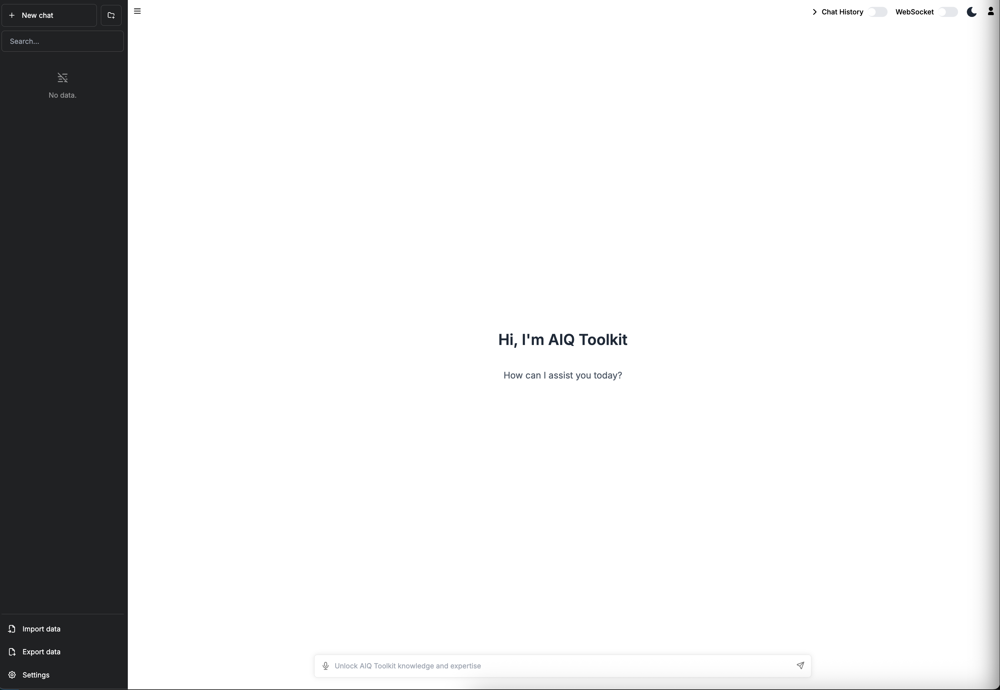
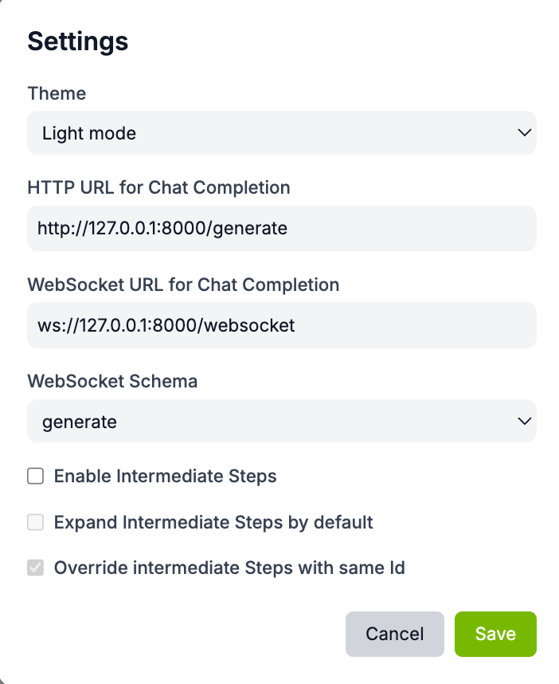
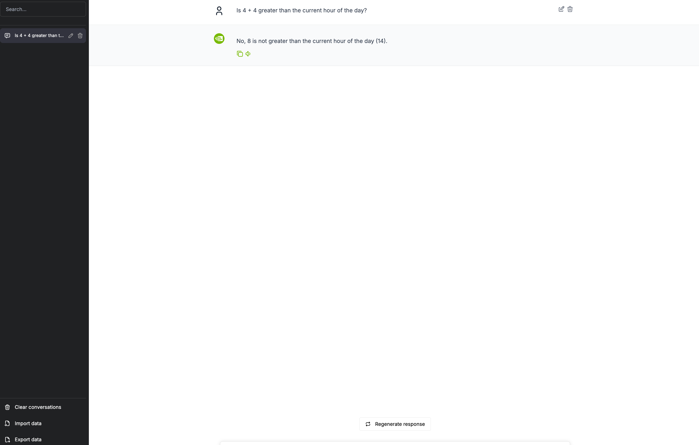

<!--
SPDX-FileCopyrightText: Copyright (c) 2025, NVIDIA CORPORATION & AFFILIATES. All rights reserved.
SPDX-License-Identifier: Apache-2.0

Licensed under the Apache License, Version 2.0 (the "License");
you may not use this file except in compliance with the License.
You may obtain a copy of the License at

http://www.apache.org/licenses/LICENSE-2.0

Unless required by applicable law or agreed to in writing, software
distributed under the License is distributed on an "AS IS" BASIS,
WITHOUT WARRANTIES OR CONDITIONS OF ANY KIND, either express or implied.
See the License for the specific language governing permissions and
limitations under the License.
-->

# Launching the NVIDIA NeMo Agent Toolkit API Server and User Interface
NVIDIA NeMo Agent toolkit provides a user interface for interacting with your running workflow. This guide walks you through starting the API server and launching the web-based user interface to interact with your workflows.

## User Interface Features
- Chat history
- Interact with a workflow via the HTTP API
- Interact with a workflow via a WebSocket
- Enable or disable a workflow's intermediate steps
- Expand all workflow intermediate steps by default
- Override intermediate steps with the same ID

## Walk-through
This walk-through guides you through the steps to set up and configure the NeMo Agent toolkit user interface.

### Prerequisites
Before starting, ensure you have:
- NeMo Agent toolkit installed and configured
- Set up the simple calculator workflow by following the instructions in `examples/getting_started/simple_calculator/README.md`
- Node.js v18+ installed (required for the web interface)


The NeMo Agent toolkit UI is located in a Git submodule at `external/nat-ui`. Ensure you have checked out all of the Git submodules by running the following:
```bash
git submodule update --init --recursive
```

### Start the NeMo Agent Toolkit Server
You can start the NeMo Agent toolkit server using the `nat serve` command with the appropriate configuration file.

```bash
nat serve --config_file=examples/getting_started/simple_calculator/configs/config.yml
```
Running this command will produce the expected output as shown below (truncated for brevity):
```bash
INFO:     Uvicorn running on http://localhost:8000 (Press CTRL+C to quit)
```

### Verify the NeMo Agent Toolkit Server is Running
After the server is running, you can make HTTP requests to interact with the workflow. This step confirms that the server is properly configured and can process requests.

```bash
curl --request POST \
  --url http://localhost:8000/generate \
  --header 'Content-Type: application/json' \
  --data '{
    "input_message": "Is 4 + 4 greater than the current hour of the day?",
    "use_knowledge_base": true
}'
```

Running this command will produce the following expected output:
> **Note:** The response depends on the current time of day that the command is run.
```bash
{
  "value": "No, 8 is less than the current hour of the day (4)."
}
```

### Launch the NeMo Agent Toolkit User Interface
After the NeMo Agent toolkit server starts, launch the web user interface. Launching the UI requires that Node.js v18+ is installed. Instructions for downloading and installing Node.js can be found in the official [Node.js documentation](https://nodejs.org/en/download).

For comprehensive information about the NeMo Agent Toolkit UI, including setup instructions, configuration options, and UI components documentation, see:
- [NeMo Agent Toolkit UI README](https://github.com/NVIDIA/NeMo-Agent-Toolkit-UI/blob/main/README.md) - Complete UI documentation and setup guide
- [UI Components Documentation](https://github.com/NVIDIA/NeMo-Agent-Toolkit-UI/tree/main/docs/ui) - Detailed information about components, features, and interface elements

```bash
cd external/nat-ui
npm install
npm run dev
```
After the web development server starts, open a web browser and navigate to [`http://localhost:3000/`](http://localhost:3000/).
Port `3001` is an alternative port if port `3000` (default) is in use.



### Connect the User Interface to the NeMo Agent Toolkit Server Using HTTP API
Configure the settings by selecting the *Settings* icon located on the bottom left corner of the home page.



#### Settings Options
**Note:** It's recommended to select `/chat/stream` for intermediate results streaming.
- `Theme`: Light or Dark Theme.
- `HTTP URL for Chat Completion`: REST API enpoint.
  - /generate
  - /generate/stream
  - /chat
  - /chat/stream
- `WebSocket URL for Completion`: WebSocket URL to connect to running NeMo Agent toolkit server.
- `WebSocket Schema`: Workflow schema type over WebSocket connection.

### Simple Calculator Example Conversation
Interact with the chat interface by prompting the Agent with the
message: `Is 4 + 4 greater than the current hour of the day?`


