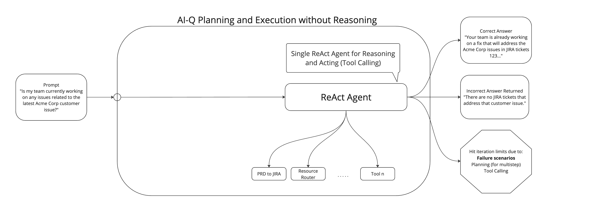
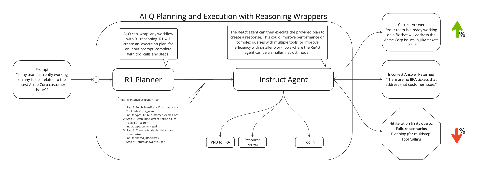

<!--
SPDX-FileCopyrightText: Copyright (c) 2025, NVIDIA CORPORATION & AFFILIATES. All rights reserved.
SPDX-License-Identifier: Apache-2.0

Licensed under the Apache License, Version 2.0 (the "License");
you may not use this file except in compliance with the License.
You may obtain a copy of the License at

http://www.apache.org/licenses/LICENSE-2.0

Unless required by applicable law or agreed to in writing, software
distributed under the License is distributed on an "AS IS" BASIS,
WITHOUT WARRANTIES OR CONDITIONS OF ANY KIND, either express or implied.
See the License for the specific language governing permissions and
limitations under the License.
-->

# Reasoning Agent

The reasoning agent is an AI system that directly invokes an underlying function while performing reasoning on top. Unlike ReAct agents, it does not reason between steps but instead through planning ahead of time. However, an LLM that support reasoning needs to be chosen for use with a reasoning agent.

---

## Features
- **Pre-built Tools**: Leverages core library agent and tools.
- **Reasoning on top of an Agent:** Leverages an underlying function, and performs reasoning on top.
- **Custom Plugin System**: Developers can bring in new tools using plugins.
- **Agentic Workflows**: Fully configurable via YAML for flexibility and productivity.
- **Ease of Use**: Simplifies developer experience and deployment.

---

## Configuration

The reasoning agent may be utilized as a workflow or a function.

### Example `config.yml`
In your YAML file, to use the reasoning agent as a workflow:
```yaml
workflow:
  _type: reasoning_agent
  llm_name: deepseek_r1_model
  # The augmented_fn is the nat Function that the execution plan is passed to. Usually an agent entry point.
  augmented_fn: react_agent
  verbose: true
```

### Configurable Options:
* `llm_name`: The LLM the agent should use. The LLM must be configured in the YAML file

* `verbose`: Defaults to False (useful to prevent logging of sensitive data). If set to True, the agent will log input, output, and intermediate steps.

* `augmented_fn`: The function to reason on. The function should be an agent and must be defined in the config YAML.

* `reasoning_prompt_template`: The prompt used in the first step of the reasoning agent. Defaults to:
  ```python
  "You are an expert reasoning model task with creating a detailed execution plan"
  " for a system that has the following description:\n\n"
  "**Description:** \n{augmented_function_desc}\n\n"
  "Given the following input and a list of available tools, please provide a detailed step-by-step plan"
  " that an instruction following system can use to address the input. Ensure the plan includes:\n\n"
  "1. Identifying the key components of the input.\n"
  "2. Determining the most suitable tools for each task.\n"
  "3. Outlining the sequence of actions to be taken.\n\n"
  "**Input:** \n{input_text}\n\n"
  "**Tools and description of the tool:** \n{tools}\n\n"
  "An example plan could look like this:\n\n"
  "1. Call tool A with input X\n"
  "2. Call tool B with input Y\n"
  "3. Interpret the output of tool A and B\n"
  "4. Return the final result"
  "\n\n **PLAN:**\n"
  ```


* `instruction_prompt_template`: The prompt used in the final step of the reasoning agent.  Defaults to:
  ```python
  "Answer the following question based on message history: {input_text}"
  "\n\nHere is a plan for execution that you could use to guide you if you wanted to:"
  "\n\n{reasoning_output}"
  "\n\nNOTE: Remember to follow your guidance on how to format output, etc."
  "\n\n You must respond with the answer to the original question directly to the user."
  ```

---

## Step-by-Step Breakdown of a Reasoning Agent

1. **User Query** – The agent receives an input or problem to solve.
2. **Reasoning on top of Function** – The agent reasons the best plan of action to take, based on the input and the augmented underlying function.
3. **Instruction / Plan Execution** – The agent invokes the underlying function, passing its plan of action along to it.

### Comparing ReAct Agent With and Without the Reasoning Agent

#### ReAct Agent Without Reasoning Agent


#### ReAct Agent With Reasoning Agent


---

## Limitations
The following are the limitations of reasoning agents:
* Requires a thinking/reasoning LLM, such as DeepSeek R1. There should be thought tags within the LLM output:
  >&lt;think&gt;&lt;/think&gt;

* Performs reasoning up front, and does not revisit the plan to revise strategy during execution like a ReAct agent does. Revising the strategy is beneficial if a tool returns a non-useful response (let's say our retriever tool did not have any relevant search results to the user's original question).
