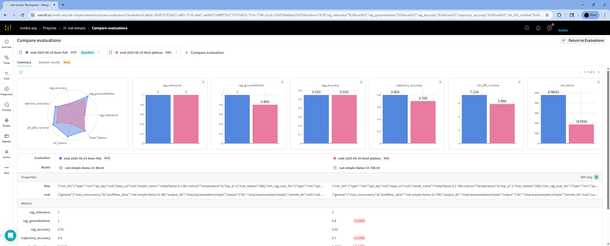
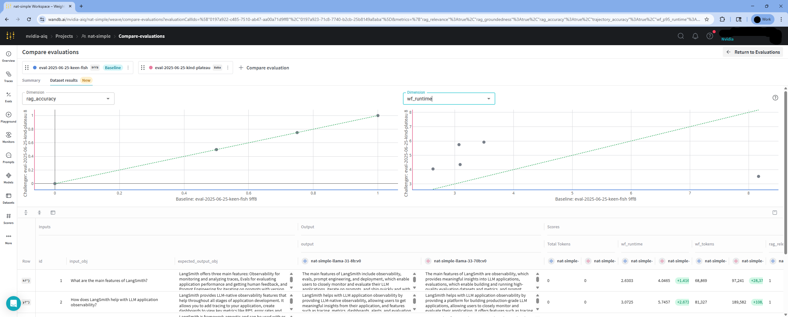

<!--
SPDX-FileCopyrightText: Copyright (c) 2024-2025, NVIDIA CORPORATION & AFFILIATES. All rights reserved.
SPDX-License-Identifier: Apache-2.0

Licensed under the Apache License, Version 2.0 (the "License");
you may not use this file except in compliance with the License.
You may obtain a copy of the License at

http://www.apache.org/licenses/LICENSE-2.0

Unless required by applicable law or agreed to in writing, software
distributed under the License is distributed on an "AS IS" BASIS,
WITHOUT WARRANTIES OR CONDITIONS OF ANY KIND, either express or implied.
See the License for the specific language governing permissions and
limitations under the License.
-->

# Evaluating NVIDIA NeMo Agent Toolkit Workflows

:::{warning}
**Experimental Feature**: The Evaluation API is experimental and may change in future releases. Future versions may introduce breaking changes without notice.
:::

NeMo Agent toolkit provides a set of evaluators to run and evaluate workflows. In addition to the built-in evaluators, the toolkit provides a plugin system to add custom evaluators.

## Evaluating a Workflow
To evaluate a workflow, you can use the `nat eval` command. The `nat eval` command takes a workflow configuration file as input. It runs the workflow using the dataset specified in the configuration file. The workflow output is then evaluated using the evaluators specified in the configuration file.

To run and evaluate the simple example workflow, use the following command:
```bash
nat eval --config_file=examples/evaluation_and_profiling/simple_web_query_eval/configs/eval_config.yml
```

## Understanding the Evaluation Configuration
The `eval` section in the configuration file specifies the dataset and the evaluators to use. The following is an example of an `eval` section in a configuration file:

`examples/evaluation_and_profiling/simple_web_query_eval/configs/eval_config.yml`:
```yaml
eval:
  general:
    output_dir: ./.tmp/nat/examples/getting_started/simple_web_query/
    dataset:
      _type: json
      file_path: examples/evaluation_and_profiling/simple_web_query_eval/data/langsmith.json
  evaluators:
    rag_accuracy:
      _type: ragas
      metric: AnswerAccuracy
      llm_name: nim_rag_eval_llm
```

The dataset section specifies the dataset to use for running the workflow. The dataset can be of type `json`, `jsonl`, `csv`, `xls`, or `parquet`. The dataset file path is specified using the `file_path` key.

## Understanding the Dataset Format
The dataset file provides a list of questions and expected answers. The following is an example of a dataset file:

`examples/evaluation_and_profiling/simple_web_query_eval/data/langsmith.json`:
```json
[
  {
    "id": "1",
    "question": "What is langsmith",
    "answer": "LangSmith is a platform for LLM application development, monitoring, and testing"
  },
  {
    "id": "2",
    "question": "How do I proptotype with langsmith",
    "answer": "To prototype with LangSmith, you can quickly experiment with prompts, model types, retrieval strategy, and other parameters"
  }
]
```

## Understanding the Evaluator Configuration
The evaluators section specifies the evaluators to use for evaluating the workflow output. The evaluator configuration includes the evaluator type, the metric to evaluate, and any additional parameters required by the evaluator.

### Display all evaluators
To display all existing evaluators, run the following command:
```bash
nat info components -t evaluator
```

### Ragas Evaluator
[RAGAS](https://docs.ragas.io/) is an OSS evaluation framework that enables end-to-end
evaluation of RAG workflows. NeMo Agent toolkit provides an interface to RAGAS to evaluate the performance
of RAG-like NeMo Agent toolkit workflows.

`examples/evaluation_and_profiling/simple_web_query_eval/configs/eval_config.yml`:
```yaml
eval:
  evaluators:
    rag_accuracy:
      _type: ragas
      metric: AnswerAccuracy
      llm_name: nim_rag_eval_llm
    rag_groundedness:
      _type: ragas
      metric: ResponseGroundedness
      llm_name: nim_rag_eval_llm
    rag_relevance:
      _type: ragas
      metric: ContextRelevance
      llm_name: nim_rag_eval_llm
```

The following `ragas` metrics are recommended for RAG workflows:

`AnswerAccuracy`: Evaluates the accuracy of the answer generated by the workflow against the expected answer or ground truth.

`ContextRelevance`: Evaluates the relevance of the context retrieved by the workflow against the question.

`ResponseGroundedness`: Evaluates the `groundedness` of the response generated by the workflow based on the context retrieved by the workflow.

These metrics use a judge LLM for evaluating the generated output and retrieved context. The judge LLM is configured in the `llms` section of the configuration file and is referenced by the `llm_name` key in the evaluator configuration.

`examples/evaluation_and_profiling/simple_web_query_eval/configs/eval_config.yml`:
```yaml
llms:
  nim_rag_eval_llm:
    _type: nim
    model_name: meta/llama-3.1-70b-instruct
    max_tokens: 8
```
For these metrics, it is recommended to use 8 tokens for the judge LLM. The judge LLM returns a floating point score between 0 and 1 for each metric where 1.0 indicates a perfect match between the expected output and the generated output.

Evaluation is dependent on the judge LLM's ability to accurately evaluate the generated output and retrieved context. This is the leadership board for the judge LLM:
```
    1)- mistralai/mixtral-8x22b-instruct-v0.1
    2)- mistralai/mixtral-8x7b-instruct-v0.1
    3)- meta/llama-3.1-70b-instruct
    4)- meta/llama-3.3-70b-instruct
```
For a complete list of up-to-date judge LLMs, refer to the [RAGAS NV metrics leadership board](https://github.com/explodinggradients/ragas/blob/main/ragas/src/ragas/metrics/_nv_metrics.py)

For more information on the prompt used by the judge LLM, refer to the [RAGAS NV metrics](https://github.com/explodinggradients/ragas/blob/main/ragas/src/ragas/metrics/_nv_metrics.py). The prompt for these metrics is not configurable. If you need a custom prompt, you can use the [Tunable RAG Evaluator](../reference/evaluate.md#tunable-rag-evaluator) or implement your own evaluator using the [Custom Evaluator](../extend/custom-evaluator.md) documentation.

### Trajectory Evaluator
This evaluator uses the intermediate steps generated by the workflow to evaluate the workflow trajectory. The evaluator configuration includes the evaluator type and any additional parameters required by the evaluator.

`examples/evaluation_and_profiling/simple_web_query_eval/configs/eval_config.yml`:
```yaml
eval:
  evaluators:
    trajectory:
      _type: trajectory
      llm_name: nim_trajectory_eval_llm
```

A judge LLM is used to evaluate the trajectory produced by the workflow, taking into account the tools available during execution. It returns a floating-point score between 0 and 1, where 1.0 indicates a perfect trajectory.

To configure the judge LLM, define it in the `llms` section of the configuration file, and reference it in the evaluator configuration using the `llm_name` key.

It is recommended to set `max_tokens` to 1024 for the judge LLM to ensure sufficient context for evaluation.

Note: Trajectory evaluation may result in frequent LLM API calls. If you encounter rate-limiting errors (such as `[429] Too Many Requests` error), you can reduce the number of concurrent requests by adjusting the `max_concurrency` parameter in your config. For example:

```yaml
eval:
  general:
    max_concurrency: 2
```
This setting reduces the number of concurrent requests to avoid overwhelming the LLM endpoint.

## Workflow Output
The `nat eval` command runs the workflow on all the entries in the `dataset`. The output of these runs is stored in a file named `workflow_output.json` under the `output_dir` specified in the configuration file.

`examples/evaluation_and_profiling/simple_web_query_eval/configs/eval_config.yml`:
```yaml
eval:
  general:
    output_dir: ./.tmp/nat/examples/getting_started/simple_web_query/
```

If additional output configuration is needed you can specify the `eval.general.output` section in the configuration file. If the `eval.general.output` section is specified, the `dir` configuration from that section overrides the `output_dir` specified in the `eval.general` section.
```yaml
eval:
  general:
    output:
      dir: ./.tmp/nat/examples/getting_started/simple_web_query/
```

Here is a sample workflow output generated by running an evaluation on the simple example workflow:

`./.tmp/nat/examples/getting_started/simple_web_query/workflow_output.json`:
```
  {
    "id": "1",
    "question": "What is langsmith",
    "answer": "LangSmith is a platform for LLM application development, monitoring, and testing",
    "generated_answer": "LangSmith is a platform for LLM (Large Language Model) application development, monitoring, and testing. It provides features such as automations, threads, annotating traces, adding runs to a dataset, prototyping, and debugging to support the development lifecycle of LLM applications.",
    "intermediate_steps": [
      {
        >>>>>>>>>>>>>>> SNIPPED >>>>>>>>>>>>>>>>>>>>>>
      }
    ],
    "expected_intermediate_steps": []
  },
```
The contents of the file have been `snipped` for brevity.

## Evaluator Output
Each evaluator provides an average score across all the entries in the `dataset`. The evaluator output also includes the score for each entry in the `dataset` along with the reasoning for the score. The score is a floating point number between 0 and 1, where 1 indicates a perfect match between the expected output and the generated output.

The output of each evaluator is stored in a separate file under the `output_dir` specified in the configuration file.

Here is a sample evaluator output generated by running evaluation on the simple example workflow:

`./.tmp/nat/examples/getting_started/simple_web_query/rag_accuracy_output.json`:
```
{
  "average_score": 0.6666666666666666,
  "eval_output_items": [
    {
      "id": 1,
      "score": 0.5,
      "reasoning": {
        "question": "What is langsmith",
        "answer": "LangSmith is a platform for LLM application development, monitoring, and testing",
        "generated_answer": "LangSmith is a platform for LLM application development, monitoring, and testing. It supports various workflows throughout the application development lifecycle, including automations, threads, annotating traces, adding runs to a dataset, prototyping, and debugging.",
        "retrieved_contexts": [
          >>>>>>> SNIPPED >>>>>>>>
        ]
      }
    },
    {
      "id": 2,
      "score": 0.75,
      "reasoning": {
        "question": "How do I proptotype with langsmith",
        "answer": "To prototype with LangSmith, you can quickly experiment with prompts, model types, retrieval strategy, and other parameters",
        "generated_answer": "LangSmith is a platform for LLM application development, monitoring, and testing. It supports prototyping, debugging, automations, threads, and capturing feedback. To prototype with LangSmith, users can quickly experiment with different prompts, model types, and retrieval strategies, and debug issues using tracing and application traces. LangSmith also provides features such as automations, threads, and feedback capture to help users develop and refine their LLM applications.",
        "retrieved_contexts": [
          >>>>>>> SNIPPED >>>>>>>>
        ]
      }
    }
  ]
}
```
The contents of the file have been `snipped` for brevity.

## Visualizing Evaluation Results
You can visualize the evaluation results using the Weights and Biases (W&B) Weave dashboard.

### Step 1: Install the Weave plugin
To install the Weave plugin, run:
```bash
uv pip install -e '.[weave]'
```

### Step 2: Enable logging to Weave in the configuration file
Edit your evaluation config, for example:
`examples/evaluation_and_profiling/simple_web_query_eval/src/nat_simple_web_query_eval/configs/eval_config_llama31.yml`:
```yaml
general:
  telemetry:
    tracing:
      weave:
        _type: weave
        project: "nat-simple"
```

When running experiments with different configurations, the `project` name should be the same to allow for comparison of runs. The `workflow_alias` can be configured to differentiate between runs with different configurations. For example to run two evaluations with different LLM models, you can configure the `workflow_alias` as follows:
`examples/evaluation_and_profiling/simple_web_query_eval/src/nat_simple_web_query_eval/configs/eval_config_llama31.yml`:
```yaml
eval:
  general:
    workflow_alias: "nat-simple-llama-31"
```
`examples/evaluation_and_profiling/simple_web_query_eval/src/nat_simple_web_query_eval/configs/eval_config_llama33.yml`:
```yaml
eval:
  general:
    workflow_alias: "nat-simple-llama-33"
```

### Step 3: Run evaluation using the configuration file
Run evaluation with the different configuration files:
```bash
nat eval --config_file examples/evaluation_and_profiling/simple_web_query_eval/src/nat_simple_web_query_eval/configs/eval_config_llama31.yml
nat eval --config_file examples/evaluation_and_profiling/simple_web_query_eval/src/nat_simple_web_query_eval/configs/eval_config_llama33.yml
```
### Step 4: View evaluation results in Weave dashboard
As the workflow runs, you will find a Weave URL (starting with a 🍩 emoji). Click on the URL to access your logged trace timeline. Select the `Eval` tab to view the evaluation results.

To compare multiple runs, select the desired runs and click the `Compare` button. This will show a summary of evaluation metrics across those runs.


To inspect results for individual dataset entries, go to the `Dataset Results` tab. You can select any available metric to compare per-metric scores.

Note: Plotting metrics for individual dataset entries is only available across two runs.


## Evaluating Remote Workflows
You can evaluate remote workflows by using the `nat eval` command with the `--endpoint` flag. In this mode the workflow is run on the remote server specified in the `--endpoint` configuration and evaluation is done on the local server.

Launch NeMo Agent toolkit on the remote server with the configuration file:
```bash
nat serve --config_file=examples/getting_started/simple_web_query/configs/config.yml
```

Run the evaluation with the `--endpoint` flag and the configuration file with the evaluation dataset:
```bash
nat eval --config_file=examples/evaluation_and_profiling/simple_web_query_eval/configs/eval_config.yml --endpoint http://localhost:8000
```

## Evaluation Endpoint
You can also evaluate workflows using the NeMo Agent toolkit evaluation endpoint. The evaluation endpoint is a REST API that allows you to evaluate workflows using the same configuration file as the `nat eval` command. The evaluation endpoint is available at `/evaluate` on the NeMo Agent toolkit server. For more information, refer to the [NeMo Agent toolkit Evaluation Endpoint](../reference/evaluate-api.md) documentation.


## Adding Custom Evaluators
You can add custom evaluators to evaluate the workflow output. To add a custom evaluator, you need to implement the evaluator and register it with the NeMo Agent toolkit evaluator system. See the [Custom Evaluator](../extend/custom-evaluator.md) documentation for more information.

## Overriding Evaluation Configuration
You can override the configuration in the `eval_config.yml` file using the `--override` command line flag. The following is an example of overriding the configuration:
```bash
nat eval --config_file examples/evaluation_and_profiling/simple_web_query_eval/configs/eval_config.yml \
        --override llms.nim_rag_eval_llm.temperature 0.7 \
        --override llms.nim_rag_eval_llm.model_name meta/llama-3.1-70b-instruct
```

## Additional Evaluation Options
For details on other evaluators and evaluation options, refer to [NeMo Agent toolkit Evaluation Concepts](../reference/evaluate.md) for more information.

##  Profiling and Performance Monitoring of NeMo Agent Toolkit Workflows
You can profile workflows using the NeMo Agent toolkit evaluation system. For more information, refer to the [Profiler](profiler.md) documentation.
