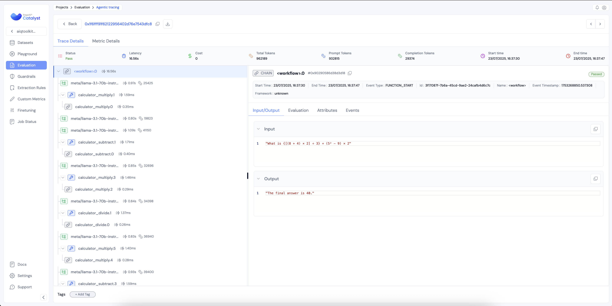

<!--
SPDX-FileCopyrightText: Copyright (c) 2025, NVIDIA CORPORATION & AFFILIATES. All rights reserved.
SPDX-License-Identifier: Apache-2.0

Licensed under the Apache License, Version 2.0 (the "License");
you may not use this file except in compliance with the License.
You may obtain a copy of the License at

http://www.apache.org/licenses/LICENSE-2.0

Unless required by applicable law or agreed to in writing, software
distributed under the License is distributed on an "AS IS" BASIS,
WITHOUT WARRANTIES OR CONDITIONS OF ANY KIND, either express or implied.
See the License for the specific language governing permissions and
limitations under the License.
-->

# Observing a Workflow with Catalyst

This guide provides a step-by-step process to enable observability in a NeMo Agent toolkit workflow using Catalyst for tracing. By the end of this guide, you will have:
- Configured telemetry in your workflow.
- Ability to view traces in the Catalyst platform.

### Step 1: Sign up for Catalyst
- Visit [https://catalyst.raga.ai/signup](https://catalyst.raga.ai/signup) to create your account.

### Step 2: Create a Project
After logging in, create a new project.
- Project Name: Choose any name.
- Use Case: `Agentic Application`

### Step 3: Generate API Credentials
Go to your [profile](https://catalyst.raga.ai/settings/authenticate) settings to generate your:
- Access Key
- Secret Key

### Step 4: Configure Your Environment
Set the following environment variables in your terminal:
```bash
export CATALYST_ACCESS_KEY=<your_access_key>
export CATALYST_SECRET_KEY=<your_secret_key>
export CATALYST_ENDPOINT=https://catalyst.raga.ai/api
```

### Step 5: Install the RagAI Subpackage

```bash
uv pip install -e '.[ragaai]'
```

### Step 6: Modify Workflow Configuration

Update your workflow configuration file to include the telemetry settings.

Example configuration:
```yaml
general:
  telemetry:
    tracing:
      catalyst:
        _type: catalyst
        project: catalyst-demo
        dataset: catalyst-dataset
        tracer_type: my-tracer-type
        endpoint: ${CATALYST_ENDPOINT}
        access_key: ${CATALYST_ACCESS_KEY}
        secret_key: ${CATALYST_SECRET_KEY}
```

### Step 7: Run Your Workflow
From the root directory of the NeMo Agent toolkit library, install dependencies and run the pre-configured `simple_calculator_observability` example.

**Example:**
```bash
# Install the workflow and plugins
uv pip install -e examples/observability/simple_calculator_observability/

# Run the workflow with Catalyst telemetry settings
# Note, you may have to update configuration settings based on your Catalyst account
nat run --config_file examples/observability/simple_calculator_observability/configs/config-catalyst.yml --input "What is 1*2?"
```
As the workflow runs, telemetry data will start showing up in Catalyst.

### Step 8: View Traces Data in Catalyst
- Open your browser and navigate to [https://catalyst.raga.ai/projects](https://catalyst.raga.ai/projects).
- Locate your workflow traces under your configured project name and dataset.
- Inspect function execution details, latency, total tokens, request timelines and other info under Info and Attributes tabs of an individual trace.



### Debugging
If you encounter issues while downloading the Catalyst package, try uninstalling and installing:
```bash
uv pip uninstall ragaai-catalyst

uv pip install ragaai-catalyst
```
