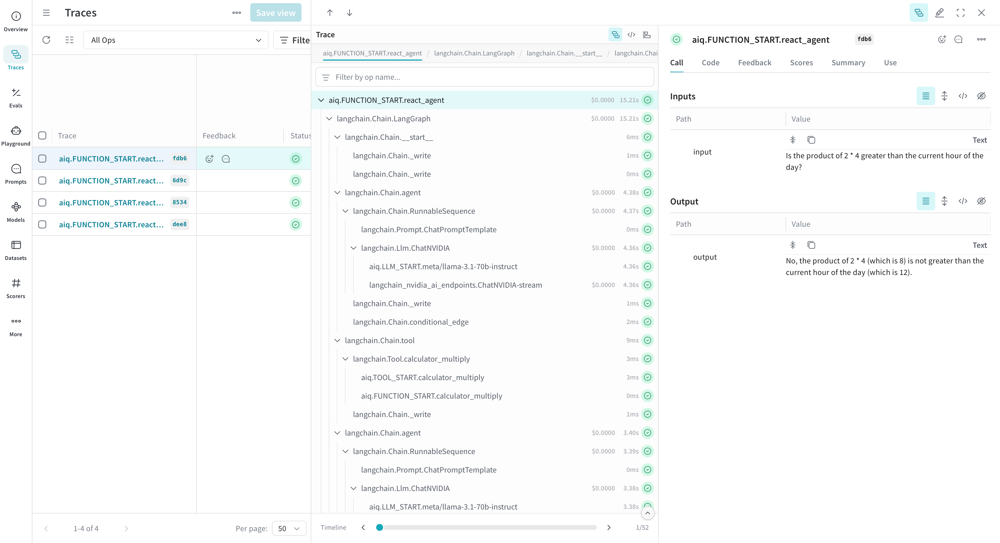

<!--
SPDX-FileCopyrightText: Copyright (c) 2025, NVIDIA CORPORATION & AFFILIATES. All rights reserved.
SPDX-License-Identifier: Apache-2.0

Licensed under the Apache License, Version 2.0 (the "License");
you may not use this file except in compliance with the License.
You may obtain a copy of the License at

http://www.apache.org/licenses/LICENSE-2.0

Unless required by applicable law or agreed to in writing, software
distributed under the License is distributed on an "AS IS" BASIS,
WITHOUT WARRANTIES OR CONDITIONS OF ANY KIND, either express or implied.
See the License for the specific language governing permissions and
limitations under the License.
-->

# Observing a Workflow with W&B Weave

This guide provides a step-by-step process to enable observability in a NeMo Agent toolkit workflow using Weights and Biases (W&B) Weave for tracing using just a few lines of code in your workflow configuration file.



### Step 1: Install the Weave plugin

To install the Weave plugin, run the following:

```bash
uv pip install -e '.[weave]'
```

### Step 2: Install the Workflow

Pick an example from the list of available workflows. In this guide, we will be using the `simple_calculator` example.

```bash
uv pip install -e examples/observability/simple_calculator_observability
```

### Step 3: Modify Workflow Configuration

Update your workflow configuration file to include the weave telemetry settings. For example, `examples/observability/simple_calculator_observability/configs/config-weave.yml` has the following weave settings:

```yaml
general:
  use_uvloop: true
  telemetry:
    tracing:
      weave:
        _type: weave
        project: "nat-demo"
```

This setup enables logging trace data to W&B weave. The weave integration requires one parameter and one optional parameter:

| Parameter | Description | Example |
|-----------|-------------|---------|
| `project` | The name of your W&B Weave project | `"nat-demo"` |
| `entity` (optional) | Your W&B username or team name | `"your-wandb-username-or-teamname"` |

### Step 4: Run Your Workflow
Install `simple_calculator` example using the instructions in the `examples/observability/simple_calculator_observability/README.md` guide.
Run the workflow using `config-weave.yml` configuration file:

```bash
nat run --config_file examples/observability/simple_calculator_observability/configs/config-weave.yml --input "Is the product of 2 * 4 greater than the current hour of the day?"
```

If it is your first time running the workflow, you will be prompted to login to W&B Weave.

### Step 5: View Traces Data in Weave Dashboard

As the workflow runs, you will find a Weave URL (starting with a 🍩 emoji). Click on the URL to access your logged trace timeline.

Note how the integration captures not only the `nat` intermediate steps but also the underlying framework. This is because [Weave has integrations](https://weave-docs.wandb.ai/guides/integrations/) with many of your favorite frameworks.

## Redacting Sensitive Data

When tracing LLM workflows, you may be processing sensitive information like personal identifiers, credit card numbers, or API keys. NeMo Agent toolkit Weave integration supports automatic redaction of Personally Identifiable Information (PII) and sensitive keys from your traces.

**Prerequisites**: To enable PII redaction, you need `presidio-analyzer` and `presidio-anonymizer` installed. Installing the weave plugin will install these packages for you.

```bash
uv pip install -e '.[weave]'
```

**Enabling PII Redaction**: Update your workflow configuration to enable PII redaction:

```yaml
general:
  use_uvloop: true
  telemetry:
    tracing:
      weave:
        _type: weave
        project: "nat-demo"
        redact_pii: true                    # Enable PII redaction
        redact_pii_fields:                  # Optional: specify which entity types to redact
          - EMAIL_ADDRESS
          - PHONE_NUMBER
          - CREDIT_CARD
          - US_SSN
          - PERSON
        redact_keys:                        # Optional: specify additional keys to redact
          - custom_secret
          - api_key
          - auth_token
```

**Redaction Options**: The Weave integration supports the following redaction options:

| Parameter | Description | Required |
|-----------|-------------|----------|
| `redact_pii` | Enable PII redaction (true/false) | No (default: false) |
| `redact_pii_fields` | List of PII entity types to redact | No (default: all supported entities) |
| `redact_keys` | List of additional keys to redact beyond the defaults | No |

When `redact_pii` is enabled, common PII entities like email addresses, phone numbers, credit cards, and more are automatically redacted from your traces before they are sent to Weave. The `redact_pii_fields` parameter allows you to customize which entity types to redact.

See the [Microsoft Presidio documentation](https://microsoft.github.io/presidio/) for a full list of supported entity types.

Additionally, the `redact_keys` parameter allows you to specify custom keys that should be redacted beyond the default sensitive keys (`api_key`, `auth_headers`, `authorization`).

## Resources

- Learn more about tracing [here](https://weave-docs.wandb.ai/guides/tracking/tracing).
- Learn more about how to navigate the logged traces [here](https://weave-docs.wandb.ai/guides/tracking/trace-tree).
- Learn more about PII redaction [here](https://weave-docs.wandb.ai/guides/tracking/redact-pii).
