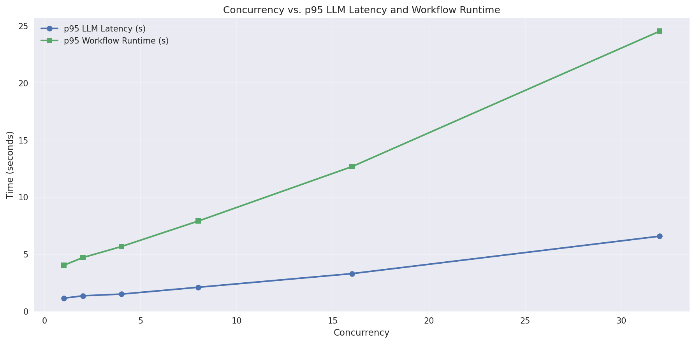

<!--
SPDX-FileCopyrightText: Copyright (c) 2025, NVIDIA CORPORATION & AFFILIATES. All rights reserved.
SPDX-License-Identifier: Apache-2.0

Licensed under the Apache License, Version 2.0 (the "License");
you may not use this file except in compliance with the License.
You may obtain a copy of the License at

http://www.apache.org/licenses/LICENSE-2.0

Unless required by applicable law or agreed to in writing, software
distributed under the License is distributed on an "AS IS" BASIS,
WITHOUT WARRANTIES OR CONDITIONS OF ANY KIND, either express or implied.
See the License for the specific language governing permissions and
limitations under the License.
-->

# Size a GPU Cluster With NVIDIA NeMo Agent Toolkit

The NVIDIA NeMo Agent toolkit provides a sizing calculator to estimate the GPU cluster size required to accommodate a target number of users with a target response time. The estimation is based on the performance of the workflow at different concurrency levels.

The sizing calculator uses the [evaluation](evaluate.md) and [profiling](./profiler.md) systems in the NeMo Agent toolkit.

## Overview

This guide assumes that you have an LLM hosted by an isolated GPU cluster, for which you want to perform the sizing calculations for.

:::{note}
Although you can run the sizing calculator against a publicly hosted LLM, the results may not be accurate due to the variability in the performance of public LLMs.
:::

## Getting Started With Sizing a GPU Cluster

To begin, set the configuration file and output directory. For this example we will start with the simple calculator evaluation configuration file, however in a real-world scenario you would use the configuration file of your own workflow you want to size.
```
export CALC_OUTPUT_DIR=.tmp/sizing_calc/
export CONFIG_FILE=${CALC_OUTPUT_DIR}config-sizing-calc.yml

mkdir -p ${CALC_OUTPUT_DIR}

cp examples/evaluation_and_profiling/simple_calculator_eval/configs/config-sizing-calc.yml $CONFIG_FILE
```

Edit `.tmp/sizing_calc/config-sizing-calc.yml` file by adding a `base_url` parameter for the `llms.nim_llm` section for your cluster. Then, if needed, change the `llms.nim_llm.model_name`.

For a locally hosted NIM this might look like:
```yaml
llms:
  nim_llm:
    _type: nim
    base_url: "http://localhost:8000/v1"
    model_name: meta/llama-3.3-70b-instruct
```

### Step 1: Gather Metrics
Collect performance data at different concurrency levels:
```
nat sizing calc --config_file $CONFIG_FILE --calc_output_dir $CALC_OUTPUT_DIR --concurrencies 1,2,4,8,16,32 --num_passes 2
```

:::{note}
Depending on the number of concurrencies, the number of passes, and the size of the cluster being tested, this could take several minutes to run.
:::

### Step 2: Estimate GPU Cluster Size
Use the previously collected metrics to estimate the GPU cluster size:
```
nat sizing calc --offline_mode --calc_output_dir $CALC_OUTPUT_DIR --test_gpu_count 8 --target_workflow_runtime 10 --target_users 100
```

You can optionally combine both steps by adding the target and test parameters to the first command. For example:
```
nat sizing calc --config_file $CONFIG_FILE --calc_output_dir $CALC_OUTPUT_DIR --concurrencies 1,2,4,8,16,32 --num_passes 2 --test_gpu_count 8 --target_workflow_runtime 10 --target_users 100
```
This will run the workflow at the specified concurrency levels and estimate the GPU cluster size.

---

## Details

### Gather Metrics
To use the calculator, gather metrics from the workflow and then separately size the cluster in `offline_mode` using the previously gathered metrics.

The following is a sample command for gathering metrics:

```
nat sizing calc --config_file $CONFIG_FILE --calc_output_dir $CALC_OUTPUT_DIR --concurrencies 1,2,4,8,16,32 --num_passes 2
```

### Dataset Requirements

When using the sizing calculator, you need a representative dataset of inputs. The size of the dataset can be as small as one input. However, if your workflow's behavior varies significantly depending on the input, we recommend including representative dataset entries for each trajectory.

The dataset is provided in the eval section of the workflow configuration file.
`examples/evaluation_and_profiling/simple_calculator_eval/configs/config-sizing-calc.yml`:
```yaml
eval:
  general:
    output_dir: .tmp/nat/examples/simple_calculator/eval
    dataset:
      _type: json
      file_path: examples/getting_started/simple_calculator/data/simple_calculator.json
```
In addition to the dataset, you need to specify the `eval.general.output_dir` parameter for storing the evaluation results. Other parameters in the eval section are not used by the calculator. For more information, refer to the [Evaluate](./evaluate.md) documentation.

The dataset used by the sizing calculator does not need to include ground truth answers. Only the inputs are needed.
For example, the following dataset is valid:
```json
[
    {
        "id": 1,
        "question": "What is the product of 3 and 7, and is it greater than the current hour?",
    },
    {
        "id": 2,
        "question": "What is the product of 4 and 5, and is it greater than the current hour?",
    }
]
```

### Specifying the Concurrency Range
A slope based mechanism is used to estimate the GPU count required for the workflow. To create a robust linear fit, we recommend using a wide range of concurrency values. A minimum of ten concurrency values is recommended, though the calculator can work with fewer values (accuracy may decrease). The concurrency range is specified as a comma separated list with the `--concurrencies` command line parameter.

In addition to the concurrency range, you can specify the number of passes made with each concurrency with the `--num_passes` command line parameter. By default the number of passes is one or a multiple of the concurrency if the dataset is larger than the concurrency value.

If the size of the dataset is smaller than the concurrency range specified, the dataset is repeated to match the concurrency range.

### Sample Output
The per-concurrency metrics are stored in the `calc_output_dir` specified in the command line. We recommend using a separate output directory for the calculator than the one used for the evaluation (specified through `eval.general.output_dir` in the workflow configuration file). This avoids accidental deletion of the calculator metrics when the evaluation jobs cleans up.

By default, the metrics of the latest calculator run overwrite the previous runs. You can use the `--append_calc_outputs` command line parameter to store each run in a separate subdirectory.

The results of each run are available in the following formats:
- A summary table
- Analysis plots
- A JSON file

**Summary Table**

The summary table provides an overview of the per-concurrency metrics.
- The `P95 LLM Latency` (95th percentile LLM latency) column contains the latency, in seconds, across all LLM invocations. If multiple models are used, the value will trend towards the latency of the model with the highest latency.
- The `P95 WF Runtime` (95th percentile workflow runtime) column contains the response time, in seconds, of the workflow and is computed across all runs at the specified concurrency.
- The `Total Runtime` columns contains the total time, in seconds, taken to process the entire dataset at a specified concurrency level.

```
Targets: LLM Latency ≤ 0.0s, Workflow Runtime ≤ 0.0s, Users = 0
Test parameters: GPUs = 0
Per concurrency results:
|   Concurrency |   p95 LLM Latency |   p95 WF Runtime |   Total Runtime |
|---------------|-------------------|------------------|-----------------|
|             1 |           1.14981 |          4.03488 |         8.06977 |
|             2 |           1.3591  |          4.71197 |         9.32298 |
|             4 |           1.50682 |          5.67581 |        11.1683  |
|             8 |           2.10668 |          7.90895 |        15.6193  |
|            16 |           3.30196 |         12.677   |        25.3173  |
|            32 |           6.57847 |         24.5307  |        43.9806  |
```
**Plots**

The calculator generates plots to help visualize the concurrency against time metrics.


An enhanced analysis plot is also generated. This plot is described in more detail in the [Slope-based Estimation](#slope-based-estimation) section.

**JSON Output**

The JSON file contains the per-concurrency metrics you can use for more analysis.
Sample output:
`calc_runner_output.json`:
```bash
{
  "gpu_estimates": {
    "gpu_estimate_by_wf_runtime": 76.61472307484419,
    "gpu_estimate_by_llm_latency": null
  },
  "per_concurrency_data": {
    "1": {
      "gpu_estimates": {
        "gpu_estimate_by_wf_runtime": 309.15830421447754,
        "gpu_estimate_by_llm_latency": null
      },
      "out_of_range_runs": {
        "num_items_greater_than_target_latency": 0,
        "num_items_greater_than_target_runtime": 0,
        "workflow_interrupted": false
      },
      >>>>>> SNIPPED <<<<<
    }
  }
}
```

The output is truncated for brevity. For more information, refer to the [CalcRunnerOutput](../../../src/nat/profiler/calc/data_models.py) Pydantic model.

### Using a Remote Workflow
By default, the calculator runs the workflow locally to gather metrics. You can use the `--endpoint` and `--endpoint_timeout` command line parameters to use a remote workflow for gathering metrics.

Start the remote workflow:
```bash
nat start fastapi --config_file=$CONFIG_FILE
```

Run the calculator using the remote endpoint:
```bash
nat sizing calc --config_file $CONFIG_FILE --calc_output_dir $CALC_OUTPUT_DIR --concurrencies 1,2,4,8,16,32 --num_passes 2 --endpoint http://localhost:8000
```
The configuration file used for running the calculator only needs to specify the `eval` section. The `workflow` section is not used by the calculator when running with a remote endpoint.

### Handling Failed Workflows
Based on the test setup, you may meet failures as the concurrency value increases. When a workflow fails for an input, the pass stops for that particular concurrency value. The pass is tagged with a `workflow_interrupted` flag in the JSON output. Such concurrencies, with a `workflow_interrupted` flag set to `true`, are not included in the GPU estimate. This information is indicated in the summary table in an `Alerts` column.

The following is sample output with alerts:
```
Targets: LLM Latency ≤ 0.0s, Workflow Runtime ≤ 0.0s, Users = 0
Test parameters: GPUs = 0
Per concurrency results:
Alerts: !W = Workflow interrupted
| Alerts |   Concurrency |   p95 LLM Latency |   p95 WF Runtime |   Total Runtime |
|--------|---------------|-------------------|------------------|-----------------|
|        | 1             | 1.14981           | 4.03488          |         8.06977 |
|        | 2             | 1.3591            | 4.71197          |         9.32298 |
| !W     | 4             | 1.50682           | 5.67581          |         11.1683 |
|        | 8             | 2.10668           | 7.90895          |         15.6193 |
|        | 16            | 3.30196           | 12.677           |         25.3173 |
|        | 32            | 6.57847           | 24.5307          |         43.9806 |
```

In this example, the workflow failed at concurrency level 4 (indicated by `!W` in the Alerts column). The time metrics for concurrency 4 are not included in the GPU estimate as they are not reliable and may skew the linear fit used to estimate the GPU count.

### Estimate GPU Cluster Size
Once the metrics are gathered, you can estimate the GPU cluster size using the `nat sizing calc` command in `offline_mode`.
Sample command:
```
nat sizing calc --offline_mode --calc_output_dir $CALC_OUTPUT_DIR --test_gpu_count 8 --target_workflow_runtime 10 --target_users 100
```

### Target and Test Parameters
**Target Parameters**

To estimate the GPU cluster size, you need to specify the target number of users and the target workflow runtime, that is the maximum acceptable response time for the workflow.

Optionally, you can specify the target p95 LLM latency if the LLM latency is a defining factor for the workflow and if it is possible to measure the maximum acceptable LLM latency.
- `target_users`: Target number of users to support.
- `target_workflow_runtime`: Target p95 workflow runtime (seconds). Can be set to 0 to ignore.
- `target_llm_latency`: Target p95 LLM latency (seconds). Can be set to 0 to ignore.

**Test Parameters**

You need to specify the number of GPUs used for running the workflow via the `--test_gpu_count` command line parameter. This is the number of GPUs used during the profiling run, not the target cluster size. This information is used to extrapolate the GPU count required for the target users.

### Slope-based Estimation

The sizing calculator uses a **slope-based estimation** approach to determine how your workflow’s performance scales with increasing concurrency. This method helps estimate the number of GPUs required to meet your target user load and response time.

**Analysis Plots**

The analysis plots, generated by the calculator, offer a visual representation of the concurrency vs. latency and concurrency vs. runtime. The trend line is a linear fit of the concurrency vs. time metrics. The slope of the trend line is used to estimate the GPU count required for the workflow.


**Estimation Process**

To estimate the GPU count required for the workflow, the calculator performs the following steps:

1. **Linear Fit of Concurrency vs. Time Metrics**
   - The calculator runs your workflow at several different concurrency levels.
   - For each level, it measures key metrics such as p95 LLM latency and p95 workflow runtime.
   - It then fits a straight line (using least squares regression) to the data points, modeling how time metrics change as concurrency increases.

2. **Slope and Intercept**
   - The **slope** of the fitted line represents how much the time metric (latency or runtime) increases for each additional concurrent user. A slope of 1.0 means that the time metric increases perfectly linearly with the concurrency. A slope greater than 1.0 means that the time metric increases faster than linearly with the concurrency and optimization should be done to reduce the slope.
   - The **intercept** represents the baseline time metric when concurrency is zero (theoretical minimum). Note that this is a mathematical extrapolation and may not correspond to actual measurements at concurrency=0. It is indicative of the overhead of the workflow.

3. **R² Value**
   - The calculator computes the R² (coefficient of determination) to indicate how well the linear model fits your data. An R² value close to 1.0 means a good fit.
   - If the R² value is less than 0.7, the calculator will not use the linear fit to estimate the GPU count.

4. **Outlier Removal**
   - Outliers (data points that deviate significantly from the trend) are automatically detected and removed to ensure a robust fit using the `Interquartile Range` (IQR) method.
   - For datasets with fewer than 8 data points, outliers are detected using raw time metric values. For larger datasets, outliers are detected using residuals from the linear fit.

5. **Estimating Required Concurrency**
   - Using your target time metric (for example, target workflow runtime), the calculator determines the maximum concurrency that can be supported for the `test_gpu_count`, while still meeting the target time. This is the `calculated_concurrency` in the formula below.

6. **GPU Count Formula**
   - The required GPU count is estimated using the formula:
     ```
     calculated_concurrency = (target_time_metric - intercept) / slope
     gpu_estimate = (target_users / calculated_concurrency) * test_gpu_count
     ```
   - This formula scales your test results to your target user load, based on the observed scaling behavior.

**Example:**

Suppose your target workflow runtime is 10 seconds, the linear fit gives a slope of 0.6, and an intercept of 3.5. The calculator will compute the concurrency that achieves a 10s runtime:
  `(10 - 3.5) / 0.6 ≈ 10.83`
If you tested with 8 GPUs and want to support 100 users, the calculator will compute the amount of GPUs needed:
  `(100 / 10.83) * 8 ≈ 73.9 GPUs`

**Key Points:**
- The more concurrency levels you test, the more accurate the estimation.
- Outliers and failed runs are excluded from the fit.
- The calculator provides both workflow runtime-based and LLM latency-based GPU estimates (if both targets are specified).

#### Interpreting the Results
The sizing calculator provides two GPU count estimates:
- `Estimated GPU count (Workflow Runtime)`: Estimated GPU count based on the target workflow runtime.
- `Estimated GPU count (LLM Latency)`: Estimated GPU count based on the target LLM latency.

You can use a maximum of the two estimates as the final GPU count to accommodate the target users.

**Sample output:**
```
Targets: LLM Latency ≤ 0.0s, Workflow Runtime ≤ 10.0s, Users = 100
Test parameters: GPUs = 8
Per concurrency results:
|   Concurrency |   p95 LLM Latency |   p95 WF Runtime |   Total Runtime |   Runtime OOR |   GPUs (WF Runtime, Rough) |
|---------------|-------------------|------------------|-----------------|---------------|----------------------------|
|             1 |           1.14981 |          4.03488 |         8.06977 |             0 |                   322.79   |
|             2 |           1.3591  |          4.71197 |         9.32298 |             0 |                   188.479  |
|             4 |           1.50682 |          5.67581 |        11.1683  |             0 |                   113.516  |
|             8 |           2.10668 |          7.90895 |        15.6193  |             0 |                    79.0895 |
|            16 |           3.30196 |         12.677   |        25.3173  |            32 |                            |
|            32 |           6.57847 |         24.5307  |        43.9806  |            64 |                            |

=== GPU ESTIMATES ===
Estimated GPU count (Workflow Runtime): 75.4
```

**Note:**

In addition to the slope based estimation, the calculator also provides a rough estimate of the GPU count required for the target user based on the data from each concurrency level. You can use this information to get a quick estimate of the GPU count required for the workflow but is not as accurate as the slope based estimation and is not recommended for production use.

### Programmatic Usage
In addition to the command line interface, the sizing calculator can be used programmatically.

**Sample code:**
```python
import asyncio
from nat.profiler.calc.calc_runner import CalcRunner
from nat.profiler.calc.data_models import CalcRunnerConfig
from nat.profiler.calc.data_models import CalcRunnerOutput

async def run_calc():
    runner_config = CalcRunnerConfig(
        config_file="config.yml",
        output_dir=".tmp/calc/",
        concurrencies=[1, 2, 4, 8, 16, 32],
        num_passes=2,
        test_gpu_count=8,
        target_workflow_runtime=10,
        target_users=100,
    )
    runner = CalcRunner(runner_config)
    result: CalcRunnerOutput = await runner.run()
    # Access GPU estimates and per-concurrency metrics from result
    print(result.gpu_estimates)
    print(result.per_concurrency_data)

# Run the async calc function
asyncio.run(run_calc())
```

{py:class}`~nat.profiler.calc.data_models.CalcRunnerConfig` is a Pydantic model that contains the configuration for the calculator. It provides fine-grained control over the calculator's behavior.
{py:class}`~nat.profiler.calc.data_models.CalcRunnerOutput` is a Pydantic model that contains the per-concurrency metrics and the GPU count estimates.
For more information, refer to the [calculator data models](../../../src/nat/profiler/calc/data_models.py).
