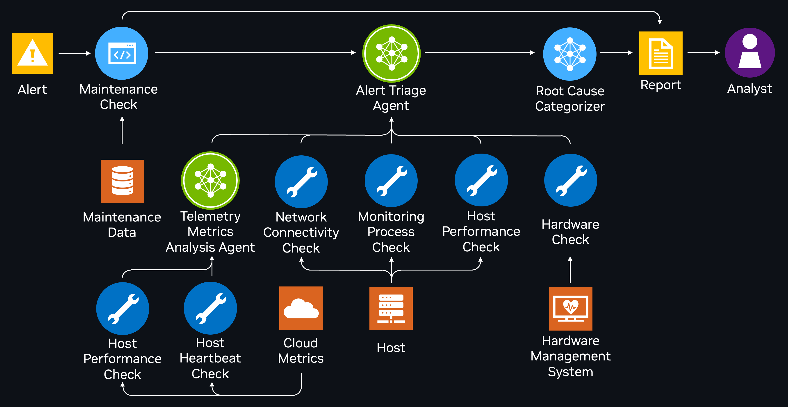

<!--
SPDX-FileCopyrightText: Copyright (c) 2025, NVIDIA CORPORATION & AFFILIATES. All rights reserved.
SPDX-License-Identifier: Apache-2.0

Licensed under the Apache License, Version 2.0 (the "License");
you may not use this file except in compliance with the License.
You may obtain a copy of the License at

http://www.apache.org/licenses/LICENSE-2.0

Unless required by applicable law or agreed to in writing, software
distributed under the License is distributed on an "AS IS" BASIS,
WITHOUT WARRANTIES OR CONDITIONS OF ANY KIND, either express or implied.
See the License for the specific language governing permissions and
limitations under the License.
-->
# Alert Triage using NeMo Agent Toolkit
This example demonstrates how to build an intelligent alert triage system using NeMo Agent toolkit and LangGraph. The system analyzes system monitoring alerts, performs diagnostic checks using various tools, and generates structured triage reports with root cause categorization. It showcases how to combine LLMs with domain-specific diagnostic tools to create an automated troubleshooting workflow.

## Table of Contents

- [Key Features](#key-features)
- [Installation and Setup](#installation-and-setup)
- [Use case description](#use-case-description)
  - [Why use an agentic design?](#why-use-an-agentic-design)
- [How it works](#how-it-works)
    - [1. Alert Received](#1-alert-received)
    - [2. Maintenance Check](#2-maintenance-check)
    - [3. Alert Triage Agent](#3-alert-triage-agent)
    - [4. Dynamic Tool Invocation](#4-dynamic-tool-invocation)
    - [5. Root Cause Categorization](#5-root-cause-categorization)
    - [6. Report Generation](#6-report-generation)
    - [7. Analyst Review](#7-analyst-review)
  - [Understanding the Configuration](#understanding-the-configuration)
    - [Functions](#functions)
    - [Workflow](#workflow)
    - [LLMs](#llms)
    - [Evaluation](#evaluation)
      - [General](#general)
      - [Evaluators](#evaluators)
- [Example Usage](#example-usage)
  - [Running in a live environment](#running-in-a-live-environment)
    - [Credentials and Access](#credentials-and-access)
  - [Running live with a HTTP server listening for alerts](#running-live-with-a-http-server-listening-for-alerts)
  - [Running in offline mode](#running-in-offline-mode)

## Key Features

- **Automated Alert Triage System:** Demonstrates an `alert_triage_agent` that autonomously investigates system monitoring alerts and generates structured triage reports with root cause analysis.
- **Multi-Tool Diagnostic Framework:** Integrates hardware checks (IPMI), network connectivity tests, host performance monitoring, process checks, and telemetry analysis for comprehensive system diagnosis.
- **Dynamic Tool Selection:** Shows how the agent intelligently selects appropriate diagnostic tools based on alert type and context, demonstrating adaptive troubleshooting workflows.
- **Structured Report Generation:** Produces markdown-formatted reports with alert summaries, collected metrics, analysis, recommended actions, and root cause categorization.
- **Maintenance-Aware Processing:** Includes maintenance database integration to distinguish between actual issues and scheduled maintenance events.

## Installation and Setup

If you have not already done so, follow the instructions in the [Install Guide](../../../docs/source/quick-start/installing.md#install-from-source) to create the development environment and install NeMo Agent toolkit, and follow the [Obtaining API Keys](../../../docs/source/quick-start/installing.md#obtaining-api-keys) instructions to obtain an NVIDIA API key.

### Install This Workflow

From the root directory of the NeMo Agent toolkit library, run the following commands:
```bash
uv pip install -e examples/advanced_agents/alert_triage_agent
```

### Set Up API Keys

Export your NVIDIA API key:
```bash
export NVIDIA_API_KEY=<YOUR API KEY HERE>
```

## Use Case Description
This example provides an agentic system designed to automate the triage of server-monitoring alerts. The system aims to address several key challenges in alert management:

* **High alert volume** overwhelms security teams and makes timely triage difficult.
* **Institutional knowledge dependency** limits scalability and consistency.
* **Manual context gathering** from scattered systems slows down investigations.
* **Tedious documentation process** make it hard to track or audit triage outcomes.

To solve the problems, the system introduces an event-driven alert triage agent that initiates automated
investigations when new alerts are generated by a monitoring platform. Rather than relying on human prompts,
the agent autonomously:

1. **Analyzes incoming alerts** to identify alert type and affected host
2. **Selects appropriate diagnostic tools** from available options:
   - Hardware checks via IPMI
   - Host performance metrics (CPU, memory)
   - Process monitoring status
   - Network connectivity tests
   - Telemetry metrics analysis
3. **Correlates data from multiple source and iteratively reasons around it** to determine root cause
4. **Generates structured reports** with:
   - Alert summary
   - Collected metrics
   - Analysis and interpretation
   - Recommended actions
   - Alert status classification
5. **Categorizes root causes** into predefined types like hardware, software, network, etc.

### Why use an agentic design?

An agentic design powered by LLMs provides key benefits over traditional rule-based systems:

- **Handles many alert types**: Traditional triage systems break down when alert types grow in number and complexity. Agentic systems adapt on the fly—no need to hard-code every investigation path.
- **Chooses the right tools dynamically**: Based on the alert context, the system can select the most relevant tools and data sources without manual intervention.
- **Built-in Reporting**: Every investigation ends with a natural language summary (with analysis, findings, and next steps), saving time and providing traceability.

## How It Works
Here's a step-by-step breakdown of the workflow:



#### 1. Alert Received
- A new alert is triggered by a monitoring system, containing details like `host_id` and `timestamp`
- Initiates the investigation process by passing a JSON-formatted alert message

#### 2. Maintenance Check
- Before deeper investigation, a [Maintenance Check](src/nat_alert_triage_agent/maintenance_check.py) tool queries a maintenance database to see if the alert coincides with scheduled maintenance
- If maintenance is ongoing, a summary report is generated explaining the maintenance context
- If no maintenance is found, the response NO_ONGOING_MAINTENANCE_STR allows for further agentic investigation

#### 3. Alert Triage Agent
- If not under maintenance, the [Alert Triage Agent](src/nat_alert_triage_agent/register.py#L34) orchestrates the investigation
- It analyzes the alert JSON to identify the alert type and affected host
- Based on this analysis, it dynamically selects appropriate diagnostic tools

#### 4. Dynamic Tool Invocation
The triage agent may call one or more of the following tools based on the alert context:
- [Telemetry Metrics Analysis Agent](src/nat_alert_triage_agent/telemetry_metrics_analysis_agent.py)
  - Collects and analyzes host-level telemetry data:
    - [Host Performance Check](src/nat_alert_triage_agent/telemetry_metrics_host_performance_check_tool.py): Pulls and analyzes CPU usage patterns
    - [Host Heartbeat Check](src/nat_alert_triage_agent/telemetry_metrics_host_heartbeat_check_tool.py): Monitors host's heartbeat signals
- [Network Connectivity Check](src/nat_alert_triage_agent/network_connectivity_check_tool.py)
  - Verifies if the host is reachable over the network.
- [Monitoring Process Check](src/nat_alert_triage_agent/monitoring_process_check_tool.py)
  - Connects to the host to verify monitoring service status (e.g. `telegraf`)
  - Checks if monitoring processes are running as expected
- [Host Performance Check](src/nat_alert_triage_agent/host_performance_check_tool.py)
  - Retrieves system performance metrics like:
    - CPU utilization
    - Memory usage
    - System load
  - Analyzes metrics in relation to the alert context
- [Hardware Check](src/nat_alert_triage_agent/hardware_check_tool.py)
  - Interfaces with IPMI for hardware-level diagnostics
  - Monitors environmental metrics:
    - Temperature readings
    - Power status
    - Hardware component health

#### 5. Root Cause Categorization
- The agent correlates data gathered from all diagnostic tools
- The [Categorizer](src/nat_alert_triage_agent/categorizer.py) uses LLM reasoning capabilities to determine the most likely root cause
- Classifies the issue into predefined categories (see the [categorizer prompt](src/nat_alert_triage_agent/prompts.py#L44)):
  - `software`: Malfunctioning or inactive monitoring services
  - `network_connectivity`: Host unreachable or connection issues
  - `hardware`: Hardware failures or degradation
  - `repetitive_behavior`: Recurring patterns like CPU spikes
  - `false_positive`: No clear signs of failure, system appears healthy
  - `need_investigation`: Insufficient information for clear root cause

#### 6. Report Generation
- Produces a markdown-formatted report containing:
  - Alert details and context
  - Maintenance status if applicable
  - Results from each diagnostic tool
  - Root cause analysis and classification
  - Recommended next steps

#### 7. Analyst Review
- The final report is presented to an Analyst for review, action, or escalation.

### Understanding the Configuration

#### Functions

Each entry in the `functions` section defines a tool or sub-agent that can be invoked by the main workflow agent. Tools can operate in offline mode, using mocked data for simulation.

Example:

```yaml
functions:
  hardware_check:
    _type: hardware_check
    llm_name: tool_reasoning_llm
    offline_mode: true
```

* `_type`: Identifies the name of the tool (matching the names in the tools' python files.)
* `llm_name`: LLM used to support the tool’s reasoning of the raw fetched data.
* `offline_mode`: If `true`, the tool uses predefined mock results for offline testing.

Some entries, like `telemetry_metrics_analysis_agent`, are sub-agents that coordinate multiple tools:

```yaml
telemetry_metrics_analysis_agent:
  _type: telemetry_metrics_analysis_agent
  tool_names:
    - telemetry_metrics_host_heartbeat_check
    - telemetry_metrics_host_performance_check
  llm_name: telemetry_metrics_analysis_agent_llm
```
#### Workflow

The `workflow` section defines the primary agent’s execution.

```yaml
workflow:
  _type: alert_triage_agent
  tool_names:
    - hardware_check
    - host_performance_check
    - monitoring_process_check
    - network_connectivity_check
    - telemetry_metrics_analysis_agent
  llm_name: ata_agent_llm
  offline_mode: true
  offline_data_path: examples/advanced_agents/alert_triage_agent/data/offline_data.csv
  benign_fallback_data_path: examples/advanced_agents/alert_triage_agent/data/benign_fallback_offline_data.json
```

* `_type`: The name of the agent (matching the agent's name in `register.py`).
* `tool_names`: List of tools (from the `functions` section) used in the triage process.
* `llm_name`: Main LLM used by the agent for reasoning, tool-calling, and report generation.
* `offline_mode`: Enables offline execution using predefined input/output instead of real systems.
* `offline_data_path`: CSV file containing offline test alerts and their corresponding mocked tool responses.
* `benign_fallback_data_path`: JSON file with baseline healthy system responses for tools not explicitly mocked.

#### LLMs

The `llms` section defines the available LLMs for various parts of the system.

Example:

```yaml
llms:
  ata_agent_llm:
    _type: nim
    model_name: meta/llama-3.3-70b-instruct
    temperature: 0.2
    max_tokens: 2048
```

* `_type`: Backend type (e.g., `nim` for NVIDIA Inference Microservice).
* `model_name`: LLM mode name.
* `temperature`, `top_p`, `max_tokens`: LLM generation parameters (passed directly into the API).

Each tool or agent can use a dedicated LLM tailored for its task.

#### Evaluation

The `eval` section defines how the system evaluates pipeline outputs using predefined metrics. It includes the location of the dataset used for evaluation and the configuration of evaluation metrics.

```yaml
eval:
  general:
    output_dir: .tmp/nat/examples/advanced_agents/alert_triage_agent/output/
    dataset:
      _type: json
      file_path: examples/advanced_agents/alert_triage_agent/data/offline_data.json
  evaluators:
    rag_accuracy:
      _type: ragas
      metric: AnswerAccuracy
      llm_name: nim_rag_eval_llm
    rag_groundedness:
      _type: ragas
      metric: ResponseGroundedness
      llm_name: nim_rag_eval_llm
    rag_relevance:
      _type: ragas
      metric: ContextRelevance
      llm_name: nim_rag_eval_llm
```

##### General

* `output_dir`: Directory where outputs (e.g., pipeline output texts, evaluation scores, agent traces) are saved.
* `dataset.file_path`: Path to the JSON dataset used for evaluation.

##### Evaluators

Each entry under `evaluators` defines a specific metric to evaluate the pipeline's output. All listed evaluators use the `ragas` (Retrieval-Augmented Generation Assessment) framework.

* `metric`: The specific `ragas` metric used to assess the output.

  * `AnswerAccuracy`: Measures whether the agent's response matches the expected answer.
  * `ResponseGroundedness`: Assesses whether the response is supported by retrieved context.
  * `ContextRelevance`: Evaluates whether the retrieved context is relevant to the query.
* `llm_name`: The name of the LLM listed in the above `llms` section that is used to do the evaluation. This LLM should be capable of understanding both the context and generated responses to make accurate assessments.

The list of evaluators can be extended or swapped out depending on your evaluation goals.


## Example Usage
You can run the agent in [offline mode](#running-in-offline-mode) or [live mode](#running-live-with-a-http-server-listening-for-alerts). Offline mode allows you to evaluate the agent in a controlled, offline environment using synthetic data. Live mode allows you to run the agent in a real environment.

### Running in a live environment
In live mode, each tool used by the triage agent connects to real systems to collect data. These systems can include:

- Cloud APIs for retrieving metrics
- On-premises endpoints for hardware monitoring
- Target hosts accessed via SSH to run diagnostic playbooks to gather system command outputs

To run the agent live, follow these steps:

1. **Configure all tools with real environment details**

   By default, the agent includes placeholder values for API endpoints, host IP addresses, credentials, and other access parameters. You must:
   - Replace these placeholders with the actual values specific to your systems
   - Ensure the agent has access permissions to query APIs or connect to hosts
   - Test each tool in isolation to confirm it works end-to-end

2. **Add custom tools if needed**

   If your environment includes unique systems or data sources, you can define new tools or modify existing ones. This allows your triage agent to pull in the most relevant data for your alerts and infrastructure.

3. **Disable offline mode**

   Set `offline_mode: false` in the workflow section and for each tool in the functions section of your config file to ensure the agent uses real data instead of offline datasets.

   You can also selectively keep some tools in offline mode by leaving their `offline_mode: true` for more granular testing.

4. **Run the agent with a real alert**

   Provide a live alert in JSON format and invoke the agent using:

   ```bash
   nat run --config_file=examples/advanced_agents/alert_triage_agent/configs/config_live_mode.yml --input {your_alert_in_json_format}
   ```
This will trigger a full end-to-end triage process using live data sources.

#### Credentials and Access

> **Note:** We recommend managing secrets (for example, API keys, SSH keys) using a secure method such as environment variables, secret management tools, or encrypted `.env` files. Never hard-code sensitive values into the source code.

### Running live with a HTTP server listening for alerts
The example includes a Flask-based HTTP server ([`run.py`](./src/nat_alert_triage_agent/run.py)) that can continuously listen for and process alerts. This allows integration with monitoring systems that send alerts via HTTP POST requests.

To use this mode, first ensure you have configured your live environment as described in the previous section. Then:
1. **Start the Alert Triage Server**

   From the root directory of the NeMo Agent toolkit library, run:
   ```bash
   python examples/advanced_agents/alert_triage_agent/src/nat_alert_triage_agent/run.py \
     --host 0.0.0.0 \
     --port 5000 \
     --env_file examples/advanced_agents/alert_triage_agent/.your_custom_env
   ```

   The server will start and display:
   ```
   ---------------[ Alert Triage HTTP Server ]-----------------
   Protocol   : HTTP
   Listening  : 0.0.0.0:5000
   Env File   : examples/advanced_agents/alert_triage_agent/.your_custom_env
   Endpoint   : POST /alerts with JSON payload
   ```

2. **Send Alerts to the Server**

   In a separate terminal, you can send alerts using `curl`. The server accepts both single alerts and arrays of alerts.

   Example: Send a single alert:
   ```bash
   curl -X POST http://localhost:5000/alerts \
     -H "Content-Type: application/json" \
     -d '{
       "alert_id": 1,
       "alert_name": "InstanceDown",
       "host_id": "test-instance-1.example.com",
       "severity": "critical",
       "description": "Instance test-instance-1.example.com is not available for scrapping for the last 5m. Please check: - instance is up and running; - monitoring service is in place and running; - network connectivity is ok",
       "summary": "Instance test-instance-1.example.com is down",
       "timestamp": "2025-04-28T05:00:00.000000"
     }'
   ```

   Example: Send multiple alerts:
   ```bash
   curl -X POST http://localhost:5000/alerts \
     -H "Content-Type: application/json" \
     -d '[{
       "alert_id": 1,
       "alert_name": "InstanceDown",
       "host_id": "test-instance-1.example.com",
       "severity": "critical",
       "description": "Instance test-instance-1.example.com is not available for scrapping for the last 5m. Please check: - instance is up and running; - monitoring service is in place and running; - network connectivity is ok",
       "summary": "Instance test-instance-1.example.com is down",
       "timestamp": "2025-04-28T05:00:00.000000"
     }, {
       "alert_id": 2,
       "alert_name": "CPUUsageHighError",
       "host_id": "test-instance-2.example.com",
       "severity": "critical",
       "description": "CPU Overall usage on test-instance-2.example.com is high ( current value 100% ). Please check: - trend of cpu usage for all cpus; - running processes for investigate issue; - is there any hardware related issues (e.g. IO bottleneck)",
       "summary": "CPU Usage on test-instance-2.example.com is high (error state)",
       "timestamp": "2025-04-28T06:00:00.000000"
     }]'
   ```

3. **Server Response**

   The server will respond with:
   ```json
   {
     "received_alert_count": 2,
     "total_launched": 5
   }
   ```

   Where:
   - `received_alert_count` shows the number of alerts received in the latest request
   - `total_launched` shows the cumulative count of all alerts processed

   Each alert will trigger an automated triage process.

4. **Monitoring the Process**

   The server logs will show:
   - When alerts are received
   - The start of each triage process
   - Any errors that occur during processing

   You can monitor the progress of the triage process through these logs and the generated reports.

### Running in Offline Mode
Offline mode lets you evaluate the triage agent in a controlled, offline environment using synthetic data. Instead of calling real systems, the agent uses predefined inputs to simulate alerts and tool outputs, ideal for development, debugging, and tuning.

To run in offline mode:
1. **Set required environment variables**

   Make sure `offline_mode: true` is set in both the `workflow` section and individual tool sections of your config file (see [Understanding the configuration](#understanding-the-configuration) section).

2. **How offline mode works:**

   - The **main CSV offline dataset** (`offline_data_path`) provides both alert details and a mock environment. For each alert, expected tool return values are included. These simulate how the environment would behave if the alert occurred on a real system.
   - The **JSON offline dataset** (`eval.general.dataset.filepath` in the config) contains a subset of the information from the main CSV: the alert inputs and their associated ground truth root causes. It is used to run `nat eval`, focusing only on the essential data needed for running the workflow, while the full CSV retains the complete mock environment context.
   - At runtime, the system links each alert in the JSON dataset to its corresponding context in the CSV using the unique host IDs included in both datasets.
   - The **benign fallback dataset** fills in tool responses when the agent calls a tool not explicitly defined in the alert's offline data. These fallback responses mimic healthy system behavior and help provide the "background scenery" without obscuring the true root cause.

3. **Run the agent in offline mode**

    To run the agent in offline mode with a test question, use the following command structure. Test questions can be found in `examples/advanced_agents/alert_triage_agent/data/offline_data.json`.

   ```bash
   nat run --config_file=examples/advanced_agents/alert_triage_agent/configs/config_offline_mode.yml --input "{your_alert_in_json_format}"
   ```

   **Example:** To run the agent with a test question, use the following command:

   ```bash
   nat run \
     --config_file=examples/advanced_agents/alert_triage_agent/configs/config_offline_mode.yml \
     --input '{
       "alert_id": 0,
       "alert_name": "InstanceDown",
       "host_id": "test-instance-0.example.com",
       "severity": "critical",
       "description": "Instance test-instance-0.example.com is not available for scrapping for the last 5m. Please check: - instance is up and running; - monitoring service is in place and running; - network connectivity is ok",
       "summary": "Instance test-instance-0.example.com is down",
       "timestamp": "2025-04-28T05:00:00.000000"
     }'
   ```

   **Expected Workflow Output**

   ```console
   <snipped for brevity>
   ## Step 1: Analyze the Alert
   The alert received is of type "InstanceDown" for the host "test-instance-0.example.com" with a critical severity. The description mentions that the instance is not available for scraping for the last 5 minutes.

   ## Step 2: Select and Use Diagnostic Tools
   Based on the alert type, the following diagnostic tools were chosen:
   - `network_connectivity_check` to verify if the host is reachable over the network.
   - `monitoring_process_check` to ensure critical monitoring processes are running on the host.
   - `hardware_check` to assess the hardware health of the host.
   - `telemetry_metrics_analysis_agent` to analyze CPU usage patterns and host heartbeat data.

   ## Step 3: Correlate Data and Determine Root Cause
   After analyzing the outputs from the diagnostic tools:
   - The `network_connectivity_check` showed successful ping and telnet connections, indicating no network connectivity issues.
   - The `monitoring_process_check` confirmed that critical processes like telegraf are running, ensuring monitoring data is being collected.
   - The `hardware_check` revealed normal hardware health with all components in a nominal state and no anomalies detected.
   - The `telemetry_metrics_analysis_agent` found the host to be up and running with normal CPU usage patterns, suggesting no significant issues.

   Given the results, it appears there is no clear indication of a real problem that would explain the "InstanceDown" alert. All diagnostic checks suggest the host is operational, and its hardware and software components are functioning as expected.

   ## Step 4: Generate a Structured Triage Report
   ### Alert Summary
   The alert "InstanceDown" for host "test-instance-0.example.com" was received, indicating the instance was not available for scraping.

   ### Collected Metrics
   - Network connectivity: Successful.
   - Monitoring processes: Running normally.
   - Hardware health: Normal.
   - Telemetry metrics: Host is up, and CPU usage is within normal ranges.

   ### Analysis
   All diagnostic checks indicate the host is operational and healthy. There is no evidence to support the "InstanceDown" alert being a true indication of a problem.

   ### Recommended Actions
   - Review monitoring system configuration to prevent false positives.
   - Verify the alerting mechanism to ensure it is not malfunctioning.

   ### Alert Status
   False alarm.

   ### Root Cause Category
   false_positive

   The diagnostic checks, including network connectivity, monitoring processes, hardware health, and telemetry metrics analysis, all indicate that the host is operational and healthy, with no evidence to support the "InstanceDown" alert being a true indication of a problem.
   --------------------------------------------------
   2025-07-21 17:14:45,234 - nat_alert_triage_agent - INFO - Cleaning up
   ```

   To evaluate the agent, use the following command:

   ```bash
   nat eval --config_file=examples/advanced_agents/alert_triage_agent/configs/config_offline_mode.yml
   ```

  The agent will:
   - Load alerts from the JSON dataset specified in the config `eval.general.dataset.filepath`
   - Investigate the alerts using predefined tool responses in the CSV file (path set in the config `workflow.offline_data_path`)
   - Process all alerts in the dataset in parallel
   - Run evaluation for the metrics specified in the config `eval.evaluators`
   - Save the pipeline output along with the evaluation results to the path specified by `eval.output_dir`

4. **Understanding the output**
    The output file will be located in the `eval.output_dir` directory and will include a `workflow_output.json` file as part of the evaluation run (alongside other results from each evaluator). This file contains a list of JSON objects, each representing the result for a single data point. Each entry includes the original alert (`question`), the ground truth root cause classification from the dataset (`answer`), the detailed diagnostic report generated by the agentic system (`generated_answer`), and a trace of the agent’s internal reasoning and tool usage (`intermediate_steps`).

   **Sample Workflow Result**
```
## Alert Summary
The alert received was for an "InstanceDown" event, indicating that the instance "test-instance-0.example.com" was not available for scraping for the last 5 minutes.

## Collected Metrics
The following metrics were collected:
- Network connectivity check: Successful ping and telnet tests indicated that the host is reachable and the monitoring service is in place and running.
- Monitoring process check: The telegraf service was found to be running and reporting metrics into InfluxDB.
- Hardware check: IPMI output showed that the system's power status is ON, hardware health is normal, and there are no observed anomalies.
- Telemetry metrics analysis: The host is up and running, and CPU usage is within normal limits.

## Analysis
Based on the collected metrics, it appears that the alert was a false positive. The host is currently up and running, and its CPU usage is within normal limits. The network connectivity and monitoring process checks also indicated that the host is reachable and the monitoring service is functioning.

## Recommended Actions
No immediate action is required, as the host is up and running, and the alert appears to be a false positive. However, it is recommended to continue monitoring the host's performance and investigate the cause of the false positive alert to prevent similar incidents in the future.

## Alert Status
The alert status is "False alarm".

## Root Cause Category
false_positive

The alert was categorized as a false positive because all collected metrics indicated the host "test-instance-0.example.com" is up, reachable, and functioning normally, with no signs of hardware or software issues, and the monitoring services are running as expected.
```
