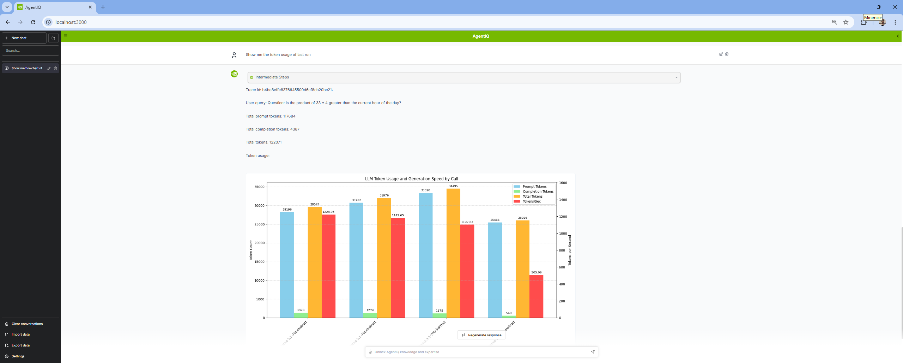

<!--
SPDX-FileCopyrightText: Copyright (c) 2025, NVIDIA CORPORATION & AFFILIATES. All rights reserved.
SPDX-License-Identifier: Apache-2.0

Licensed under the Apache License, Version 2.0 (the "License");
you may not use this file except in compliance with the License.
You may obtain a copy of the License at

http://www.apache.org/licenses/LICENSE-2.0

Unless required by applicable law or agreed to in writing, software
distributed under the License is distributed on an "AS IS" BASIS,
WITHOUT WARRANTIES OR CONDITIONS OF ANY KIND, either express or implied.
See the License for the specific language governing permissions and
limitations under the License.
-->

# NeMo Agent Toolkit Profiler Agent

The profiler agent is a tool that allows you to analyze the performance of NeMo Agent toolkit workflows. It uses the Phoenix server to store and retrieve traces of workflow runs.

## Table of Contents

- [Key Features](#key-features)
- [Installation and Setup](#installation-and-setup)
  - [Install this Workflow](#install-this-workflow)
  - [Set Up API Keys](#set-up-api-keys)
- [Run the Workflow](#run-the-workflow)
- [Features](#features)

## Key Features

- **Workflow Performance Analysis:** Demonstrates a specialized agent that analyzes NeMo Agent toolkit workflow performance using Phoenix server traces for comprehensive performance monitoring.
- **Token Usage Tracking:** Shows how to retrieve and analyze token consumption patterns across multiple workflow runs, providing insights into LLM resource utilization.
- **Trace Visualization:** Generates flowcharts and visual representations of workflow execution patterns from stored Phoenix traces using natural language queries.
- **Phoenix Server Integration:** Demonstrates integration with Phoenix observability platform for storing, retrieving, and analyzing workflow telemetry data.
- **Natural Language Interface:** Provides a conversational interface for querying performance metrics, making complex trace analysis accessible through simple questions.

## Installation and Setup

If you have not already done so, follow the instructions in the [Install Guide](../../../docs/source/quick-start/installing.md) to create the development environment and install NeMo Agent toolkit.

### Install this Workflow:

From the root directory of the NeMo Agent toolkit library, run the following commands:

```bash
uv pip install -e examples/advanced_agents/profiler_agent
```

### Set Up API Keys
If you have not already done so, follow the [Obtaining API Keys](../../../docs/source/quick-start/installing.md#obtaining-api-keys) instructions to obtain an NVIDIA API key. You need to set your NVIDIA API key as an environment variable to access NVIDIA AI services:

```bash
export NVIDIA_API_KEY=<YOUR_API_KEY>
```

## Run the Workflow

1. Start the Phoenix server if not already running. If you are using a remote Phoenix server, you can skip this step and modify the configs/config.yml file to point to the URL.
   ```bash
   docker run -p 6006:6006 -p 4317:4317 -i -t arizephoenix/phoenix:latest
   ```

2. Ensure that there are traces in the Phoenix server. You can use the simple calculator example to generate traces.
   > Note: This requires installing both the optional `telemetry` dependencies along with the simple calculator. You can do this by running the following commands:
   > ```bash
   > uv pip install -e examples/observability/simple_calculator_observability
   > ```

   Then, run the simple calculator example to generate traces:
   ```bash
   nat run --config_file examples/observability/simple_calculator_observability/configs/config-phoenix.yml --input "Is the product of 2 * 4 greater than the current hour of the day?"
   nat run --config_file examples/observability/simple_calculator_observability/configs/config-phoenix.yml --input "Is the product of 33 * 4 greater than the current hour of the day?"
   nat run --config_file examples/observability/simple_calculator_observability/configs/config-phoenix.yml --input "Is the sum of 44 and 55 greater than the current hour of the day?"
   nat run --config_file examples/observability/simple_calculator_observability/configs/config-phoenix.yml --input "Is the difference between 7 and 5 less than the current hour of the day?"
   ```

3. Run the profiler agent:
   ```
   nat serve --config_file=examples/advanced_agents/profiler_agent/configs/config.yml
   ```

4. Launch the NeMo Agent Toolkit User Interface by using the instructions in the [Launching the User Interface](../../../docs/source/quick-start/launching-ui.md#launch-the-nemo-agent-toolkit-user-interface) guide.

5. Query the agent with natural language via the UI:
   ```
   Show me the token usage of last run
   ```

   

   More examples:
   ```
   Show me flowchart of last 3 runs
   ```

   ```
   Analyze the last 2 runs
   ```

## Features

- Query Phoenix traces with natural language
- Analyze LLM application performance metrics
- Generate trace visualizations
- Extract user queries across trace spans
