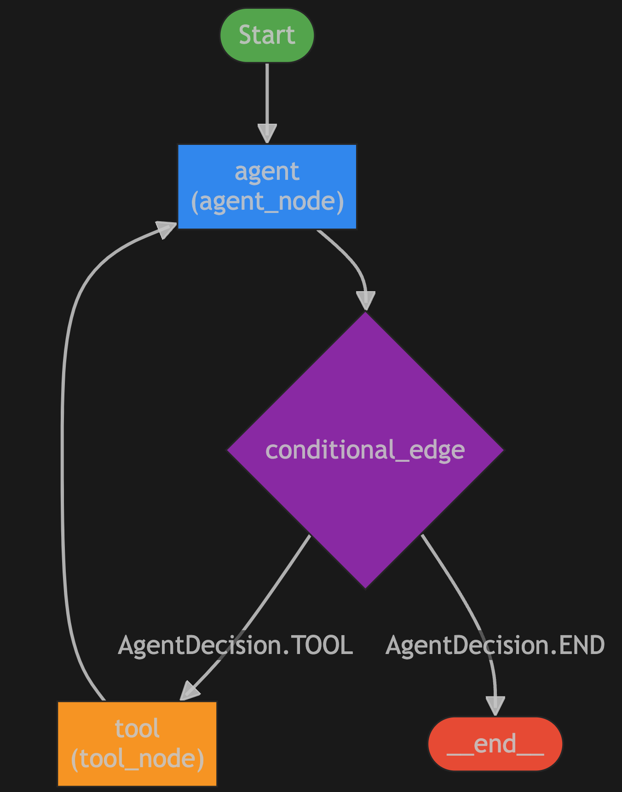

<!--
SPDX-FileCopyrightText: Copyright (c) 2025, NVIDIA CORPORATION & AFFILIATES. All rights reserved.
SPDX-License-Identifier: Apache-2.0

Licensed under the Apache License, Version 2.0 (the "License");
you may not use this file except in compliance with the License.
You may obtain a copy of the License at

http://www.apache.org/licenses/LICENSE-2.0

Unless required by applicable law or agreed to in writing, software
distributed under the License is distributed on an "AS IS" BASIS,
WITHOUT WARRANTIES OR CONDITIONS OF ANY KIND, either express or implied.
See the License for the specific language governing permissions and
limitations under the License.
-->

<!--
  SPDX-FileCopyrightText: Copyright (c) 2024-2025 NVIDIA CORPORATION & AFFILIATES. All rights reserved.
  SPDX-License-Identifier: Apache-2.0
-->

# Mixture of Agents Example

An example of a Mixture of Agents (naive Mixture of Experts / naive Agent Hypervisor). This agent leverages the NeMo Agent toolkit plugin system and `WorkflowBuilder` to integrate pre-built and custom tools into the workflows, and workflows as tools. Key elements are summarized below:

## Table of Contents

- [Key Features](#key-features)
- [Graph Structure](#graph-structure)
- [Installation and Setup](#installation-and-setup)
  - [Install this Workflow](#install-this-workflow)
  - [Set Up API Keys](#set-up-api-keys)
  - [Run the Workflow](#run-the-workflow)
  - [Starting the NeMo Agent Toolkit Server](#starting-the-nemo-agent-toolkit-server)
  - [Making Requests to the NeMo Agent Toolkit Server](#making-requests-to-the-nemo-agent-toolkit-server)

## Key Features

- **Hierarchical Agent Architecture:** Demonstrates a `react_agent` serving as a master orchestrator that routes queries to specialized `tool_calling_agent` experts based on query content and agent descriptions.
- **Multiple Specialized Agents:** Includes distinct expert agents for different domains - an `internet_agent` for web searches, a `code_agent` for programming tasks, and additional specialized agents.
- **Agent-as-Tool Integration:** Shows how complete agent workflows can be wrapped and used as tools by other agents, enabling complex multi-agent orchestration.
- **Mixed Agent Types:** Combines ReAct agents (for orchestration and reasoning) with Tool Calling agents (for specialized execution), demonstrating interoperability between different agent frameworks.
- **Scalable Expert System:** Provides a pattern for building systems where a reasoning agent can delegate work to multiple domain-specific expert agents, each with their own specialized tool sets.

## Graph Structure

Both the ReAct agent and Tool Calling agents in this mixture follow the same dual-node graph architecture that alternates between reasoning and tool execution. The following diagram illustrates the shared workflow pattern:

<div align="center">

</div>

**Shared Workflow Pattern:**
- **Start**: Each agent begins processing with input
- **Agent Node**: Performs reasoning and decides whether to use a tool or provide a final answer
- **Conditional Edge**: Routes the flow based on the agent's decision
- **Tool Node**: Executes the selected tool when needed
- **Cycle**: Agents can loop between reasoning and tool execution until reaching a final answer

This consistent architecture allows both ReAct and Tool Calling agents to work seamlessly together in the mixture, each contributing their specialized capabilities while following the same operational pattern.

## Installation and Setup

If you have not already done so, follow the instructions in the [Install Guide](../../../docs/source/quick-start/installing.md#install-from-source) to create the development environment and install NeMo Agent toolkit.

### Install this Workflow

From the root directory of the NeMo Agent toolkit repository, run the following commands:

```bash
uv pip install -e .
```

### Set Up API Keys
If you have not already done so, follow the [Obtaining API Keys](../../../docs/source/quick-start/installing.md#obtaining-api-keys) instructions to obtain an NVIDIA API key. You need to set your NVIDIA API key as an environment variable to access NVIDIA AI services:
```bash
export NVIDIA_API_KEY=<YOUR_API_KEY>
```

### Run the Workflow

Run the following command from the root of the NeMo Agent toolkit repo to execute this workflow with the specified input:

```bash
nat run --config_file=examples/agents/mixture_of_agents/configs/config.yml --input "who was Djikstra?"
```

**Expected Output**

```console
<snipped for brevity>

2025-04-23 14:57:14,060 - nat.agent.react_agent.agent - INFO -
------------------------------
[AGENT]
Agent input: who was Djikstra?
Agent's thoughts:
Thought: I should search the internet for information on Djikstra.
Action: internet_agent
Action Input: {'input_message': 'Djikstra'}
Observation
------------------------------
2025-04-23 14:57:20,638 - nat.agent.tool_calling_agent.agent - INFO -
------------------------------
[AGENT]
Agent input: Djikstra
Agent's thoughts:
content="Dijkstra's algorithm is a well-known algorithm in graph theory, named after the Dutch computer scientist Edsger W. Dijkstra. It is used to find the shortest path between two nodes in a graph. The algorithm works by maintaining a list of unvisited nodes and iteratively selecting the node with the shortest distance from the starting node. The distance to each node is updated as the algorithm progresses, and the node with the shortest distance is added to the list of visited nodes. The algorithm terminates when the destination node is reached, and the shortest path is constructed by tracing back the nodes from the destination to the starting node.\n\nDijkstra's algorithm has many applications in computer science and other fields, such as network routing, traffic optimization, and resource allocation. It is also used in many real-world problems, such as finding the shortest path between two cities, optimizing traffic flow, and scheduling tasks.\n\nThe algorithm has a time complexity of O(|E| + |V|log|V|) in the worst case, where |E| is the number of edges and |V| is the number of vertices in the graph. This makes it efficient for large graphs. However, it can be slow for very large graphs or graphs with a large number" additional_kwargs={} response_metadata={'role': 'assistant', 'content': "Dijkstra's algorithm is a well-known algorithm in graph theory, named after the Dutch computer scientist Edsger W. Dijkstra. It is used to find the shortest path between two nodes in a graph. The algorithm works by maintaining a list of unvisited nodes and iteratively selecting the node with the shortest distance from the starting node. The distance to each node is updated as the algorithm progresses, and the node with the shortest distance is added to the list of visited nodes. The algorithm terminates when the destination node is reached, and the shortest path is constructed by tracing back the nodes from the destination to the starting node.\n\nDijkstra's algorithm has many applications in computer science and other fields, such as network routing, traffic optimization, and resource allocation. It is also used in many real-world problems, such as finding the shortest path between two cities, optimizing traffic flow, and scheduling tasks.\n\nThe algorithm has a time complexity of O(|E| + |V|log|V|) in the worst case, where |E| is the number of edges and |V| is the number of vertices in the graph. This makes it efficient for large graphs. However, it can be slow for very large graphs or graphs with a large number", 'token_usage': {'prompt_tokens': 363, 'total_tokens': 613, 'completion_tokens': 250}, 'finish_reason': 'length', 'model_name': 'meta/llama-3.3-70b-instruct'} id='run-44bec667-41ec-43a8-bbe2-ecacfe0580e8-0' usage_metadata={'input_tokens': 363, 'output_tokens': 250, 'total_tokens': 613} role='assistant'
------------------------------
2025-04-23 14:57:20,641 - nat.agent.react_agent.agent - INFO -
------------------------------
[AGENT]
Calling tools: internet_agent
Tool's input: {"input_message": "Djikstra"}
Tool's response:
Dijkstra's algorithm is a well-known algorithm in graph theory, named after the Dutch computer scientist Edsger W. Dijkstra. It is used to find the shortest path between two nodes in a graph. The algorithm works by maintaining a list of unvisited nodes and iteratively selecting the node with the shortest distance from the starting node. The distance to each node is updated as the algorithm progresses, and the node with the shortest distance is added to the list of visited nodes. The algorithm terminates when the destination node is reached, and the shortest path is constructed by tracing back the nodes from the destination to the starting node.

Dijkstra's algorithm has many applications in computer science and other fields, such as network routing, traffic optimization, and resource allocation. It is also used in many real-world problems, such as finding the shortest path between two cities, optimizing traffic flow, and scheduling tasks.

The algorithm has a time complexity of O(|E| +...
------------------------------
2025-04-23 14:57:22,680 - nat.agent.react_agent.agent - INFO -
------------------------------
[AGENT]
Agent input: who was Djikstra?
Agent's thoughts:
Thought: I now know the final answer
Final Answer: Edsger W. Dijkstra was a Dutch computer scientist, and Dijkstra's algorithm is a well-known algorithm in graph theory used to find the shortest path between two nodes in a graph.
------------------------------
2025-04-23 14:57:22,684 - nat.front_ends.console.console_front_end_plugin - INFO -
--------------------------------------------------
Workflow Result:
["Edsger W. Dijkstra was a Dutch computer scientist, and Dijkstra's algorithm is a well-known algorithm in graph theory used to find the shortest path between two nodes in a graph."]
```
---

### Starting the NeMo Agent Toolkit Server

You can start the NeMo Agent toolkit server using the `nat serve` command with the appropriate configuration file.

**Starting the Mixture of Agents Example Workflow**

```bash
nat serve --config_file=examples/agents/mixture_of_agents/configs/config.yml
```

### Making Requests to the NeMo Agent Toolkit Server

Once the server is running, you can make HTTP requests to interact with the workflow.

#### Non-Streaming Requests

**Non-Streaming Request to the Mixture of Agents Example Workflow**

```bash
curl --request POST \
  --url http://localhost:8000/generate \
  --header 'Content-Type: application/json' \
  --data '{"input_message": "What are LLMs?"}'
```

#### Streaming Requests

**Streaming Request to the Mixture of Agents Example Workflow**

```bash
curl --request POST \
  --url http://localhost:8000/generate/stream \
  --header 'Content-Type: application/json' \
  --data '{"input_message": "What are LLMs?"}'
```
