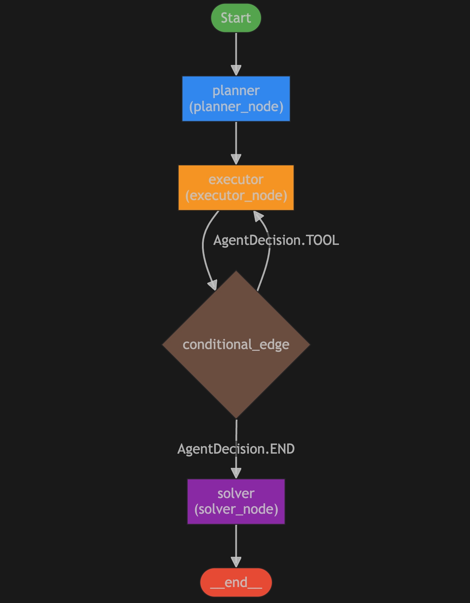

<!--
SPDX-FileCopyrightText: Copyright (c) 2025, NVIDIA CORPORATION & AFFILIATES. All rights reserved.
SPDX-License-Identifier: Apache-2.0

Licensed under the Apache License, Version 2.0 (the "License");
you may not use this file except in compliance with the License.
You may obtain a copy of the License at

http://www.apache.org/licenses/LICENSE-2.0

Unless required by applicable law or agreed to in writing, software
distributed under the License is distributed on an "AS IS" BASIS,
WITHOUT WARRANTIES OR CONDITIONS OF ANY KIND, either express or implied.
See the License for the specific language governing permissions and
limitations under the License.
-->

# ReWOO Agent Example

This example demonstrates how to use A configurable [ReWOO](https://arxiv.org/abs/2305.18323) (Reasoning WithOut Observation) Agent with the NeMo Agent toolkit. For this purpose NeMo Agent toolkit provides a [`rewoo_agent`](../../../docs/source/workflows/about/rewoo-agent.md) workflow type.

## Table of Contents

- [Key Features](#key-features)
- [Graph Structure](#graph-structure)
- [Installation and Setup](#installation-and-setup)
  - [Install this Workflow](#install-this-workflow)
  - [Set Up API Keys](#set-up-api-keys)
- [Run the Workflow](#run-the-workflow)
  - [Starting the NeMo Agent Toolkit Server](#starting-the-nemo-agent-toolkit-server)
  - [Making Requests to the NeMo Agent Toolkit Server](#making-requests-to-the-nemo-agent-toolkit-server)
  - [Evaluating the ReWOO Agent Workflow](#evaluating-the-rewoo-agent-workflow)

## Key Features

- **ReWOO Agent Architecture:** Demonstrates the unique `rewoo_agent` workflow type that implements Reasoning Without Observation, separating planning, execution, and solving into distinct phases.
- **Three-Node Graph Structure:** Uses a distinctive architecture with Planner Node (creates complete execution plan), Executor Node (executes tools systematically), and Solver Node (synthesizes final results).
- **Systematic Tool Execution:** Shows how ReWOO first plans all necessary steps upfront, then executes them systematically without dynamic re-planning, leading to more predictable tool usage patterns.
- **Calculator and Internet Search Integration:** Includes `calculator_inequality` and `internet_search` tools to demonstrate multi-step reasoning that requires both mathematical computation and web research.
- **Plan-Execute-Solve Pattern:** Demonstrates the ReWOO approach of complete upfront planning followed by systematic execution and final result synthesis.

## Graph Structure

The ReWOO agent uses a unique three-node graph architecture that separates planning, execution, and solving into distinct phases. The following diagram illustrates the agent's workflow:

<div align="center">

</div>

**Workflow Overview:**
- **Start**: The agent begins processing with user input
- **Planner Node**: Creates a complete execution plan with all necessary steps upfront
- **Executor Node**: Executes tools according to the plan, looping until all steps are completed
- **Solver Node**: Takes all execution results and generates the final answer
- **End**: Process completes with the final response

This architecture differs from other agents by separating reasoning (planning) from execution, allowing for more systematic and predictable tool usage patterns. The ReWOO approach first plans all steps, then executes them systematically, and finally synthesizes the results.

## Installation and Setup

If you have not already done so, follow the instructions in the [Install Guide](../../../docs/source/quick-start/installing.md#install-from-source) to create the development environment and install NeMo Agent toolkit.

### Install this Workflow

From the root directory of the NeMo Agent toolkit library, run the following commands:

```bash
uv sync --all-groups --all-extras
uv pip install -e .
```

### Set Up API Keys
If you have not already done so, follow the [Obtaining API Keys](../../../docs/source/quick-start/installing.md#obtaining-api-keys) instructions to obtain an NVIDIA API key. You need to set your NVIDIA API key as an environment variable to access NVIDIA AI services:

```bash
export NVIDIA_API_KEY=<YOUR_API_KEY>
```

Prior to using the `tavily_internet_search` tool, create an account at [`tavily.com``](https://tavily.com/) and obtain an API key. Once obtained, set the `TAVILY_API_KEY` environment variable to the API key:
```bash
export TAVILY_API_KEY=<YOUR_TAVILY_API_KEY>
```

## Run the Workflow

Run the following command from the root of the NeMo Agent toolkit repo to execute this workflow with the specified input:

```bash
nat run --config_file=examples/agents/rewoo/configs/config.yml --input "Which city held the Olympic game in the year represented by the bigger number of 1996 and 2004?"
```

**Expected Workflow Output**
```console
<snipped for brevity>

- ReWOO agent planner output:
------------------------------
[AGENT]
Agent input: Which city held the Olympic game in the year represented by the bigger number of 1996 and 2004?
Agent's thoughts:
[
  {
    "plan": "Compare the numbers 1996 and 2004 to determine the bigger number.",
    "evidence": {
      "placeholder": "#E1",
      "tool": "calculator_inequality",
      "tool_input": {"text": "2004 > 1996"}
    }
  },
  {
    "plan": "Since 2004 is indeed bigger, search for the city that held the Olympic Games in 2004.",
    "evidence": {
      "placeholder": "#E2",
      "tool": "internet_search",
      "tool_input": {"question": "Which city held the Olympic Games in 2004?"}
    }
  }
]
------------------------------
2025-04-23 15:02:11,047 - nat.agent.rewoo_agent.agent - INFO - ReWOO agent executor output:
------------------------------
[AGENT]
Calling tools: calculator_inequality
Tool's input: {'text': '2004 > 1996'}
Tool's response:
First number 2004 is greater than the second number 1996
------------------------------
2025-04-23 15:02:13,096 - nat.agent.rewoo_agent.agent - INFO - ReWOO agent executor output:
------------------------------
[AGENT]
Calling tools: internet_search
Tool's input: {'question': 'Which city held the Olympic Games in 2004?'}
Tool's response:
<Document href="https://en.wikipedia.org/wiki/2004_Summer_Olympics"/>
The 2004 Summer Olympics (Greek: Θερινοί Ολυμπιακοί Αγώνες 2004, romanized: Theriní Olympiakí Agónes 2004),[b] officially the Games of the XXVIII Olympiad (Αγώνες της 28ης Ολυμπιάδας, Agónes tis 28is Olympiádas), and officially branded as Athens 2004 (Αθήνα 2004), were an international multi-sport event held from 13 to 29 August 2004 in Athens, Greece. [...] Emblem of the 2004 Summer Olympics[a]
Location    Athens, Greece
Motto   Welcome Home
(Greek: Καλώς ήρθατε σπίτι, romanized: Kalós írthate spíti)
Nations 201
Athletes    10,557 (6,257 men, 4,300 women)
Events  301 in 28 sports (40 disciplines)
Opening 13 August 2004
Closing 29 August 2004
Opened by   President Konstantinos Stephanopoulos[1]
Closed by   IOC President Jacques Rogge
Cauldron    Nikolaos Kaklamanakis[1]
Stadium Olympic Stadium
Summer
← Sydney 2000
Beijing 2008 →
Winter [...] See also[edit]
    Olympic Games portal
2004 Summer Paralympics
Olympic Game...
------------------------------
2025-04-23 15:02:13,382 - nat.agent.rewoo_agent.agent - INFO - ReWOO agent solver output:
------------------------------
[AGENT]
Agent input: Which city held the Olympic game in the year represented by the bigger number of 1996 and 2004?
Agent's thoughts:
Athens
------------------------------
2025-04-23 15:02:13,385 - nat.front_ends.console.console_front_end_plugin - INFO -
--------------------------------------------------
Workflow Result:
['Athens']
--------------------------------------------------
```

### Starting the NeMo Agent Toolkit Server

You can start the NeMo Agent toolkit server using the `nat serve` command with the appropriate configuration file.

**Starting the ReWOO Agent Example Workflow**

```bash
nat serve --config_file=examples/agents/rewoo/configs/config.yml
```

### Making Requests to the NeMo Agent Toolkit Server

Once the server is running, you can make HTTP requests to interact with the workflow.

#### Non-Streaming Requests

**Non-Streaming Request to the ReWOO Agent Example Workflow**

```bash
curl --request POST \
  --url http://localhost:8000/generate \
  --header 'Content-Type: application/json' \
  --data '{"input_message": "Which city held the Olympic game in the year represented by the bigger number of 1996 and 2004?"}'
```

#### Streaming Requests

**Streaming Request to the ReWOO Agent Example Workflow**

```bash
curl --request POST \
  --url http://localhost:8000/generate/stream \
  --header 'Content-Type: application/json' \
  --data '{"input_message": "Which city held the Olympic game in the year represented by the bigger number of 1996 and 2004?"}'
```
---

### Evaluating the ReWOO Agent Workflow
**Run and evaluate the `rewoo_agent` example Workflow**

```bash
nat eval --config_file=examples/agents/rewoo/configs/config.yml
```
