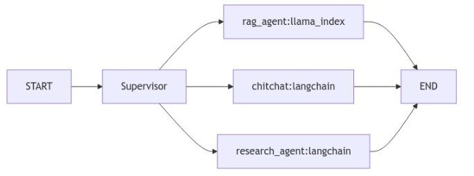

<!--
SPDX-FileCopyrightText: Copyright (c) 2025, NVIDIA CORPORATION & AFFILIATES. All rights reserved.
SPDX-License-Identifier: Apache-2.0

Licensed under the Apache License, Version 2.0 (the "License");
you may not use this file except in compliance with the License.
You may obtain a copy of the License at

http://www.apache.org/licenses/LICENSE-2.0

Unless required by applicable law or agreed to in writing, software
distributed under the License is distributed on an "AS IS" BASIS,
WITHOUT WARRANTIES OR CONDITIONS OF ANY KIND, either express or implied.
See the License for the specific language governing permissions and
limitations under the License.
-->

# Multi-Frameworks Example

This example demonstrates how to integrate multiple AI frameworks seamlessly using a set of LangChain / LangGraph agents, in NeMo Agent toolkit.
NeMo Agent toolkit is framework-agnostic, allowing usage of custom and pre-built preferred AI tools without restriction due to AI framework.

## Table of Contents

- [Overview](#overview)
- [Why This Matters](#why-this-matters)
- [Key Features](#key-features)
- [Installation and Setup](#installation-and-setup)
  - [Install this Workflow](#install-this-workflow)
  - [Set Up API Keys](#set-up-api-keys)
- [Example Usage](#example-usage)
  - [Run the Workflow](#run-the-workflow)

## Overview

LangChain is incredibly flexible, LlamaIndex is incredibly powerful for building RAG pipelines;
different AI frameworks excel at different tasks.
Instead of committing to just one, this example shows how they can work together via NeMo Agent toolkit.

In this example, we combine:
- **Haystack Agent** – with a configurable LLM.
- **LangChain Research Tool** – web search.
- **LlamaIndex RAG Tool** – document Q&A (pre-configured to use this README)

This example workflow leverages the NeMo Agent toolkit plugin system and `Builder` object to demonstrate how the `Builder` object can dynamically wrap any Python function—regardless of its underlying AI framework or implementation—and convert it into another AI framework of our choice.

In this example, we wrap all three of the above tools as LangChain Tools.
Then, using LangChain and LangGraph, we unify these frameworks into a single workflow, demonstrating interoperability and flexibility. The goal is not to favor one tool over another but to showcase how different AI stacks can complement each other.


## Why This Matters

- **Leverage Strengths** – Different AI frameworks specialize in different areas.
- **Interoperability** – Combine tools seamlessly without vendor lock-in.
- **Scalability** – Build flexible AI pipelines that adapt to different use cases.

## Key Features

- **Multi-Framework Integration:** Demonstrates seamless integration of LangChain, LlamaIndex, and Haystack frameworks within a single NeMo Agent toolkit workflow.
- **Framework-Agnostic Agent Architecture:** Shows a supervisor agent that routes queries to specialized worker agents built with different underlying frameworks (LlamaIndex RAG, LangChain research, Haystack chitchat).
- **Cross-Framework Tool Wrapping:** Demonstrates how the NeMo Agent toolkit Builder can dynamically wrap any Python function from any framework and convert it into LangChain tools for unified orchestration.
- **Specialized Agent Workers:** Includes three distinct agents - a `rag_agent` using LlamaIndex for document Q&A, a `research_agent` using LangChain for arXiv research, and a chitchat agent using Haystack pipelines.
- **Dynamic Framework Selection:** Shows how different AI frameworks can be selected automatically based on query type, leveraging each framework's specific strengths without vendor lock-in.

There is a supervisor agent that will assign and route incoming user queries to one of the worker agents.
The 3 worker agents are:

- (1) a `rag_agent` made out of `llama_index` via a custom `llama-index-rag` tool
- (2) a `research_agent` made out of a LangChain runnable chain with tool calling capability, able to call arXiv as a tool and return summarized found research papers
- (3) a chitchat agent that is able to handle general chitchat query from user, constructed via haystack's pipeline

the multi-agents architecture looks like the below



## Installation and Setup

If you have not already done so, follow the instructions in the [Install Guide](../../../docs/source/quick-start/installing.md#install-from-source) to create the development environment and install NeMo Agent toolkit.

### Install this Workflow

```bash
uv pip install -e examples/frameworks/multi_frameworks
```

### Set Up API Keys

If you have not already done so, follow the [Obtaining API Keys](../../../docs/source/quick-start/installing.md#obtaining-api-keys) instructions to obtain an NVIDIA API key. You need to set your NVIDIA API key as an environment variable to access NVIDIA AI services.

```bash
export NVIDIA_API_KEY=<YOUR_API_KEY>
```

For Tavily API key, create an account at [`tavily.com`](https://tavily.com/) and obtain an API key. Once obtained, set the `TAVILY_API_KEY` environment variable to the API key:
```bash
export TAVILY_API_KEY=<YOUR_TAVILY_API_KEY>
```

## Example Usage

### Run the Workflow

note: the below is an example command to use and query this and trigger `rag_agent`

```bash
nat run --config_file=examples/frameworks/multi_frameworks/configs/config.yml --input "tell me about this workflow"
```

**Expected Workflow Output**
```console
This workflow is a multi-frameworks example that can be installed locally and run using specific commands. To install the workflow, you need to run `uv pip install -e examples/frameworks/multi_frameworks`. After installation, you can run the workflow using the command `nat run --config_file=examples/frameworks/multi_frameworks/configs/config.yml --input "your query here"`. You can replace "your query here" with any input you want to query the workflow with.
```

Note: the below is an example command to use and query this and trigger `research_agent`

```bash
nat run --config_file=examples/frameworks/multi_frameworks/configs/config.yml --input "what is RAG?"
```
**Expected Workflow Output**
```console
Retrieval-Augmented Generation (RAG) is the process of optimizing the output of a large language model, so it references an authoritative knowledge base outside of its training data sources before generating a response. Large Language Models (LLMs) are trained on vast volumes of data and use billions of parameters to generate original output for tasks like answering questions, translating languages, and completing sentences. RAG extends the already powerful capabilities of LLMs to specific
```
